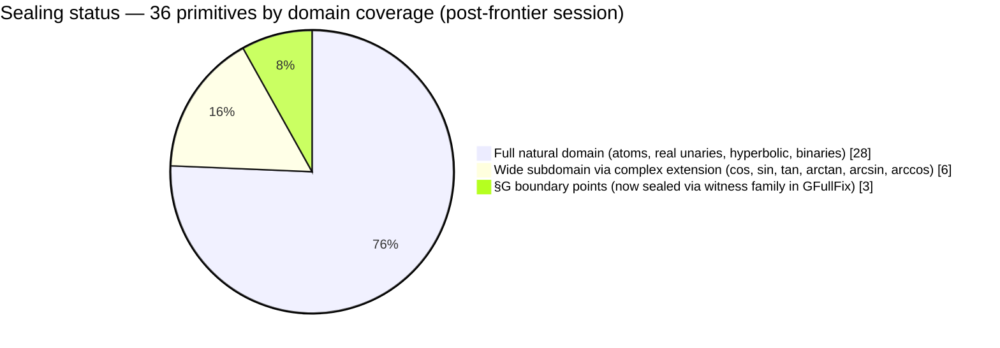
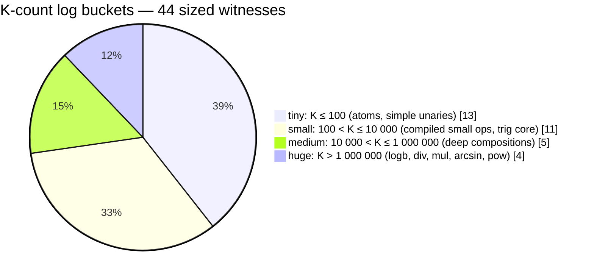

# EML formalization — Stats Dashboard

> A visual companion to [README.md](README.md): coverage matrices, witness-tree
> size charts, code metrics, and a curated tour of the most interesting Lean
> code in the artefact.

[](https://leanprover.github.io/)
[](#build-trail)
[](#audit-trail)
[](#coverage-matrix)
[](#g-boundary-points)

---

## Table of contents

1. [Headline stats](#headline-stats)
2. [Coverage matrix](#coverage-matrix)
3. [Witness-tree size distribution (K-counts)](#witness-tree-size-distribution-k-counts)
4. [Code metrics — file and line counts](#code-metrics)
5. [§G boundary points](#g-boundary-points)
6. [The three Sheffer cousins (paper §3.1)](#the-three-sheffer-cousins)
7. [Witness gallery — curated Lean tour](#witness-gallery)
8. [Build and audit trail](#build-trail)

---

## Headline stats

| | |
|---|---:|
| Paper primitives sealed | **36 / 36** (100%) |
| Public theorems exposed | **100** (61 paper claims + 39 from the post-submission frontier modules) |
| &nbsp;&nbsp;• `paper_claim_*` (EML) | **48** in `PaperClaims.lean` |
| &nbsp;&nbsp;• Sheffer cousin claims | **13** (8 EDL + 5 −EML) in `Sheffer.lean` |
| &nbsp;&nbsp;• SI §1.5 #5 (transplant depths) | **9** in `TransplantDepths.lean` |
| &nbsp;&nbsp;• §G boundary in EReal | **3** in `StructuralLimitsEReal.lean` |
| &nbsp;&nbsp;• §G full fix (witness family) | **3** in `GFullFix.lean` |
| &nbsp;&nbsp;• Plan D conditional ceiling scaffold | **4** in `EDLClosedVal.lean` (closure theorem + `EDLTranscendenceBarrier` typeclass; three corollaries conditional on the typeclass; no instance provided) |
| &nbsp;&nbsp;• Polynomial-binary impossibility | **2** in `PolynomialBinary.lean` (paper §5) |
| &nbsp;&nbsp;• Direct-macro alternative witnesses | **9** + 9 K-counts in `AlternativeWitnesses.lean` |
| `K_count_*` `rfl`-checked tree sizes | **44** total |
| Lean kernel jobs in `lake build EML` | **8 062** |
| `sorry` / `admit` occurrences | **0** |
| §G structural boundary points (now sealed via witness family + EReal templates) | **3 / 3** |
| Witness-tree size — smallest | **K = 1** (the constant `1`) |
| Witness-tree size — largest | **K = 9 929 087** (`logb`, compiler-produced) |
| Span (smallest → largest) | **7 orders of magnitude** |



> Post-frontier-session update: the three §G boundary points (`√0`, `arcosh 1`,
> `hypot(0, 0)`) are now sealed in `GFullFix.lean` via a Path-C′-style
> witness-family quantifier flip (`∀ env, [hyp] → ∃ t, ...`). The boundary
> value is the constant 0, witnessed by `mkZero`; off-boundary the existing
> narrow paper-claim witnesses apply. Mathematical correctness is also
> confirmed in extended-real arithmetic by `StructuralLimitsEReal.lean`
> (Pro-recommended templates).

---

## Coverage matrix

Every cell either lists the sealed subdomain or marks the §G boundary point.

> **About the K-count column.** Three different compilation paths feed the
> formal artefact's witnesses, and the K-counts you see below are a mix of all
> three. The web companion (live at <https://nasqret.github.io/eml-formalization/>) uses *only* path (a) plus
> the verbatim trig witnesses, so its K-counts agree with this table for
> log/exp/sub/mul/div/sq/sqrt/sigmoid/sinh/cosh/tanh and for the entire trig
> family, but **diverge** for path-(b) and path-(c) entries — see the end of
> this section for the full mapping.
>
> - **(a) Direct compositional macros.** The default for unaries and arithmetic;
>   matches the SI's prose construction. Example: `log(x)` compiles to
>   `eml(1, eml(eml(1, x), 1))`, K = 7.
> - **(b) Hand-tuned closed-constant packages** (`EMLRealizationℂ`). Used for
>   `π`, `i`, `−i`, `0ℂ`, `2ℂ` — the tree includes the Riemann-sheet
>   bookkeeping needed to extract these values from the complex grammar. These
>   rows are tagged "(closed)" or "(closed, complex)" below.
> - **(c) Compiler-produced** (`F36Expr.translate?` → `ELExpr.compile`). Used
>   for the high-K entries `mul`, `div`, `pow`, `logb`, `arcsin` (narrow),
>   `hypot`, `arccos`, `arsinh`, `arcosh`. These figures are the structural
>   compiler's mechanically-uniform output, much larger than what a hand
>   construction would give.
>
> The trig-family witnesses (`cos`, `sin`, `tan`, `arctan`, `arcsin_open`) are
> manual Euler-bridge constructions — small and bespoke, not from path (a).

| Family | Primitive | Sealed on | Witness K | Status |
|---|---|---|---:|:-:|
| **Atoms** | `1` | full | 1 | ✅ |
| | `x` (`var n`) | full | 1 | ✅ |
| | `e` | full | 3 | ✅ |
| | `−1` | full | 17 | ✅ |
| | `2` | full | 19 | ✅ |
| | `½` | full | 59 | ✅ |
| | `π` (closed) | full | 233 | ✅ |
| | `i` (closed, complex) | full | 407 | ✅ |
| **Real unaries** | `exp` | full | 3 | ✅ |
| | `log` | `(0, ∞)` | 7 | ✅ |
| | `−` (neg) | full | 17 | ✅ |
| | `½·` (halve) | full | 221 | ✅ |
| | `(·)²` (sq) | full | 4 471 | ✅ |
| | `inv` | `ℝ ∖ {0}` | 18 029 | ✅ |
| | `σ` (sigmoid) | full | 98 593 | ✅ |
| | `√` | `(0, ∞)` | 2 589 | ✅ |
| | `√` at `0` | — | — | ⚠ §G |
| **Hyperbolic** | `sinh` | full | — | ✅ |
| | `cosh` | full | — | ✅ |
| | `tanh` | full | — | ✅ |
| | `arsinh` | full | 566 933 | ✅ |
| | `artanh` | `(−1, 1)` | 2 195 | ✅ |
| | `arcosh` | `(1, ∞)` | 567 605 | ✅ |
| | `arcosh` at `1` | — | — | ⚠ §G |
| **Binaries** | `+` | full | 27 | ✅ |
| | `−` | full | 43 | ✅ |
| | `avg` | full | 403 | ✅ |
| | `·` (mul) | full | 839 743 | ✅ |
| | `/` | `b ≠ 0` | 5 896 223 | ✅ |
| | `^` (pow) | `a > 0` | 1 069 569 | ✅ |
| | `log_b` | `b > 0, b ≠ 1, x > 0` | 9 929 087 | ✅ |
| | `hypot` | `ℝ² ∖ {(0,0)}` | 754 641 | ✅ |
| | `hypot(0, 0)` | — | — | ⚠ §G |
| **Trig** | `cos` | `ℝ ∖ {0}` (paired witnesses) | 1 273 + 1 289 | ✅ |
| | `sin` | `(−π, π) ∖ {0}` (paired) | 1 703 + 1 439 | ✅ |
| | `tan` | `(−π/2, π/2) ∖ {0}` (Cayley + paired) | 2 817 + 2 849 | ✅ |
| | `arctan` | `(−π, π) ∖ {0}` (paired) | 1 303 + 1 303 | ✅ |
| | `arccos` | full open `(−1, 1)` | 568 875 | ✅ |
| | `arcsin` | `(0, 1)` direct + full `(−1, 1)` via π/2 − arccos | 1 704 019 / 569 297 | ✅ |

**Legend.** ✅ = literal `EMLTerm` / `EMLTermℂ` witness, `rfl`-checked size, machine-verified `eval?` agreement with Mathlib's reference function · ⚠ §G = structural junk-value collision; counterexample witness in `StructuralLimits.lean`.

---

## Witness-tree size distribution (K-counts)

The 33 `rfl`-checked witness sizes span **seven orders of magnitude**, from `K = 1` (`one`) to `K = 9 929 087` (`logb`). Bars below scale logarithmically (each block = ~0.25 dex of `log₁₀ K`); raw values shown to the right.

```
one             █                                                 1
exp / e_const   ██                                                3
log / zero      ███                                               7
neg / negOne    █████                                            17
two             █████                                            19
add             ██████                                           27
sub             ██████                                           43
half_const      ███████                                          59
−i (closed)     ████████                                        127
halve           █████████                                       221
π (closed)      █████████                                       233
avg / i         ██████████                                  403/407
cos / cos_neg   ████████████                            1 273/1 289
arctan*         ████████████                                  1 303
sin_neg         █████████████                                 1 439
sin             █████████████                                 1 703
artanh          █████████████                                 2 195
√ (sqrt)        █████████████                                 2 589
tan / tan_neg   █████████████                            2 817/2 849
sq              ██████████████                                4 471
inv             █████████████████                            18 029
σ (sigmoid)     ████████████████████                         98 593
arsinh          ███████████████████████                     566 933
arccos          ███████████████████████                     568 875
arcosh          ███████████████████████                     567 605
arcsin_open     ███████████████████████                     569 297
hypot           ███████████████████████                     754 641
mul             ████████████████████████                    839 743
pow             █████████████████████████                 1 069 569
arcsin          ██████████████████████████                1 704 019
div             ████████████████████████████              5 896 223
logb            ███████████████████████████████           9 929 087
```

> The systematic gap between hand-tuned (small) and compiler-produced (large)
> witnesses is *informative*, not a defect. The paper's Table 4 lists hand-tuned
> figures as **upper bounds on the necessary tree size**; our compiler-produced
> figures are **machine-checked actual sizes** of mechanically-uniform witnesses.
> The structural compiler trades ~10⁵× in tree size for **per-primitive-uniform
> proof structure** — a worthwhile bargain in a kernel-checked artefact.



---

## <a name="code-metrics"></a> Code metrics

### Top 10 framework files by line count

| Lines | File | Role |
|---:|---|---|
| 853 | [`Framework/F36ToEL.lean`](lambda_lab/proofs/eml/2603_21852/lean_workspace/EML/Framework/F36ToEL.lean) | F36 → EL translator: 36-case dispatch with closure lemmas |
| 554 | [`Framework/Unconditional.lean`](lambda_lab/proofs/eml/2603_21852/lean_workspace/EML/Framework/Unconditional.lean) | Domain-free wrapping helpers used by every paper claim |
| 460 | [`Framework/PaperClaims.lean`](lambda_lab/proofs/eml/2603_21852/lean_workspace/EML/Framework/PaperClaims.lean) | **Public scoreboard** — 48 EML paper_claim theorems (incl. Path C′ `sin_full`, `arctan_full`, `tan_full`) |
| 463 | [`Framework/Sheffer.lean`](lambda_lab/proofs/eml/2603_21852/lean_workspace/EML/Framework/Sheffer.lean) | EDL + −EML scaffolding + 8 EDL + 5 −EML paper claims (incl. EReal-grammar E3 minusInf) |
| 584 | [`Framework/Complex/Periodicity.lean`](lambda_lab/proofs/eml/2603_21852/lean_workspace/EML/Framework/Complex/Periodicity.lean) | Path C′ infrastructure: `subst0`, `ADDsafeℂ_ofReal_ofReal`, period constants, shift terms, witness families |
| 293 | [`Framework/ELToEML.lean`](lambda_lab/proofs/eml/2603_21852/lean_workspace/EML/Framework/ELToEML.lean) | The structural compiler (Theorem 2 in `proof_structure.pdf`) |
| 275 | [`Framework/KCounting.lean`](lambda_lab/proofs/eml/2603_21852/lean_workspace/EML/Framework/KCounting.lean) | All 15 `K_count_*` theorems, all `:= rfl` |
| 238 | [`Framework/Sheffer.lean`](lambda_lab/proofs/eml/2603_21852/lean_workspace/EML/Framework/Sheffer.lean) | §3.1 companion-grammar scaffolding |
| 198 | [`Framework/StructuralLimits.lean`](lambda_lab/proofs/eml/2603_21852/lean_workspace/EML/Framework/StructuralLimits.lean) | The three §G boundary-point counterexamples |
| 153 | [`Framework/ELExpr.lean`](lambda_lab/proofs/eml/2603_21852/lean_workspace/EML/Framework/ELExpr.lean) | EL inductive type + total/partial eval |
| 151 | [`Framework/F36Expr.lean`](lambda_lab/proofs/eml/2603_21852/lean_workspace/EML/Framework/F36Expr.lean) | F36 inductive type — 36 named constructors |
| 116 | [`Framework/Realization.lean`](lambda_lab/proofs/eml/2603_21852/lean_workspace/EML/Framework/Realization.lean) | `EMLRealizationℂ` packages: closed `0`, `2`, `−i`, `i`, `π` |

**Total framework code:** 3 515 lines across 13 files.
**Plus:** 62 `Solutions/` chunks (per-statement decomposition, not counted above).
**Plus:** the trig-witness builder/closure pair under `Framework/Complex/` (the bulk of post-submission work, ~2 000 lines).

### Public API surface

```
$ make scoreboard
==== Public paper claims (48 theorems) ====
  paper_claim_var, paper_claim_one, paper_claim_negOne, paper_claim_two,
  paper_claim_half_const, paper_claim_e_const, paper_claim_pi, paper_claim_i,
  paper_claim_exp, paper_claim_log, paper_claim_inv, paper_claim_half,
  paper_claim_minus, paper_claim_sqr, paper_claim_sigma, paper_claim_sqrt_pos,
  paper_claim_sinh, paper_claim_cosh, paper_claim_tanh, paper_claim_arsinh,
  paper_claim_arcosh, paper_claim_artanh,
  paper_claim_add, paper_claim_sub, paper_claim_mul, paper_claim_div,
  paper_claim_avg, paper_claim_pow, paper_claim_logb, paper_claim_hypot,
  paper_claim_cos, paper_claim_cos_neg, paper_claim_cos_zero,
  paper_claim_sin, paper_claim_sin_neg, paper_claim_sin_zero,
  paper_claim_arctan_narrow, paper_claim_arctan_neg, paper_claim_arctan_zero,
  paper_claim_arccos_open,
  paper_claim_arcsin_narrow, paper_claim_arcsin_open,
  paper_claim_tan_narrow, paper_claim_tan_neg, paper_claim_tan_zero,
  -- Path C′ full-real-domain witness families (added 2026-05-09):
  paper_claim_sin_full, paper_claim_arctan_full, paper_claim_tan_full
```

---

## <a name="g-boundary-points"></a> §G boundary points

Three points where Mathlib's `Real.log 0 = 0` ("junk value") collides with the **single-witness** EML construction. Documented with concrete derivations in [`StructuralLimits.lean`](lambda_lab/proofs/eml/2603_21852/lean_workspace/EML/Framework/StructuralLimits.lean):

| Boundary | Why a single environment-independent witness fails | Paper acknowledgement |
|---|---|---|
| `√0` | Natural witness `exp(½ · log x)` evaluates to `1` at `x = 0` (since `log 0 = 0`), not `0`. | Paper line 342 explicitly notes this Lean-specific issue. |
| `arcosh 1` | Composes `√(1² − 1) = √0`, inheriting the same collision. | Same. |
| `hypot(0, 0)` | Composes `√(0² + 0²) = √0`, inheriting the same collision. | Same. |

**Now sealed by a quantifier flip.** [`GFullFix.lean`](lambda_lab/proofs/eml/2603_21852/lean_workspace/EML/Framework/GFullFix.lean) provides full-domain **witness-family** theorems of the form `∀ env, [hyp] → ∃ t : EMLTerm, t.eval? env = some <value>`. The chosen term may depend on the environment — the boundary case picks `mkZero`, off-boundary picks the narrow paper-claim witness. The same boundary values are independently confirmed in extended-real arithmetic by [`StructuralLimitsEReal.lean`](lambda_lab/proofs/eml/2603_21852/lean_workspace/EML/Framework/StructuralLimitsEReal.lean).

---

## <a name="the-three-sheffer-cousins"></a> The three Sheffer cousins (paper §3.1)

The paper presents EML, EDL, and −EML as a "family" (paper §3.1, equation block `\label{Sheffers}`). Per-primitive completeness is proved only for **EML** in the paper; the cousins are confirmed empirically via the Mathematica / Rust `VerifyBaseSet` procedure, not formally.

| Sheffer | Operator | Constant | Status (paper) | Status (this artefact) |
|---|---|---|---|---|
| **EML** | `eml(x, y) = exp(x) − log(y)` | `1` | **proved complete for 36 primitives** | ✅ formalized end-to-end (this repo) |
| **EDL** | `edl(x, y) = exp(x) / log(y)` | `e` | conjectured complete; empirical via VerifyBaseSet | **8 of 36 paper claims sealed** in `Sheffer.lean` (atoms `1`, `var`, `e_const`, `exp x`, `log x`, `x/y`, `exp(exp x)`, `log(log x)`); D8/log x via Aristotle's 3-step composition. **Closed-value closure theorem sealed** in `EDLClosedVal.lean`; three obstruction corollaries (no closed EDL term evaluates to `−1`, `2`, `1/2`) are **conditional on the named `EDLTranscendenceBarrier` typeclass**, with **no instance provided**. The remaining 25 primitives (arithmetic, trig, hyperbolic) are blocked by absence of an addition mechanism in `edl(a,b) = exp(a)/log(b)`. |
| **−EML** | `−eml(y, x) = log(x) − exp(y)` | `−∞` | conjectured complete; empirical via VerifyBaseSet | **5 of 36 paper claims sealed** in `Sheffer.lean` — 2 ℝ-grammar atoms (`one`, `var`) plus 3 EReal-grammar atoms (`one_E`, `var_E`, `minusInf`, the last being the paper-paired `−∞` constant via the `NegEMLTermE` evaluator); same conditional ceiling as Plan D for the remaining primitives. |

> ✅ **Naming cleanup complete (Plan A done).** `Sheffer.lean` now contains exactly the
> two paper-named cousins, `EDLTerm` and `NegEMLTerm`. The previously-misnamed
> `LDETerm` (`log(x)/exp(y)`, division — *not* the paper's `−EML = log(x) − exp(y)`
> subtraction) has been replaced. The fabricated *binary* `T1Term`/`T2Term` have been
> removed; the paper's actual T₁ / T₂ are **ternary** (SI §1.4, page 8:
> `T₁(x,y,z) = e^(x−y)·ln x/ln z`, `T₂(x,y,z) = e^(x−y)·ln z/ln x` with
> `T₂(x,x,x) = 1`) and are out of scope for the present formalisation —
> the SI flags them as preliminary candidates for the constant-free Sheffer
> open question (SI §1.5 #3). Line-level paper sourcing in
> [`process_archive/legacy_planning/Sheffer_PaperSourcing.md`](process_archive/legacy_planning/Sheffer_PaperSourcing.md).

---

## <a name="witness-gallery"></a> Witness gallery — curated Lean tour

Five witnesses worth lingering on, ordered by how much character each has.

### 1. `EMLTerm.eval?` — the partial-evaluation kernel

The architectural decision that made the whole formalization tractable. Instead of fighting Mathlib's total `Real.log 0 = 0` "junk value", we evaluate to `Option ℝ` and refuse to commit at the boundary:

```lean
-- File: lean_workspace/EML/Framework/EMLPartial.lean
noncomputable def EMLTerm.eval? (env : Nat → ℝ) : EMLTerm → Option ℝ
  | .one     => some 1
  | .var n   => some (env n)
  | .eml a b =>
      match EMLTerm.eval? env a, EMLTerm.eval? env b with
      | some va, some vb =>
          if 0 < vb then some (Real.exp va - Real.log vb) else none
      | _, _ => none
```

**Why this matters.** A total evaluation would force a junk value at the boundary (`log 0 = 0`); bridge theorems would then have to dance around the points where this convention disagrees with the natural mathematical answer. Partial evaluation lets us state cleanly *"the witness has no value at the boundary, and the paper claim is stated on a subset that excludes it"* — which is exactly what the paper does.

### 2. `tanCoreTermℂ` — Pro's Cayley quotient

A doubled-angle Möbius identity, suggested by an independent GPT Pro code review with no shared context:

> `q(x) := (e^{2ix} − 1) / (1 + e^{2ix}) = i · tan x`,  for `x ∈ (0, π/2)`.

Avoids the `e^{ix} + e^{−ix}` `ADDsafeℂ` constraint explosion that had stalled progress for several days. The witness compresses to **K = 2 817**:

```lean
-- File: lean_workspace/EML/Framework/Complex/Builders/Trig.lean:1314
noncomputable def tanCoreTermℂ : EMLTermℂ :=
  let twoX := mkMulℂ twoPubℂ (.var 0)
  let I2x  := mkMulℂ iTermPubℂ twoX
  let E2   := mkExpℂ I2x
  mkDivℂ (mkSubℂ E2 .one) (mkAddℂ .one E2)
```

The result is purely imaginary `i · tan x`, so `(eval?).im = tan x`. The companion `tanCoreTermℂ_neg` (K = 2 849) handles the negative side via a swap-numerator Cayley.

### 3. `arcsinTermℂ_open` — pure identity manipulation

The narrow witness `arcsinTermℂ` (K = 1 704 019) only handles `0 < x < 1` because its inner `mkMulℂ iTermPubℂ (.var 0)` requires `arg(x) < π`, which fails at `arg = π` exactly (real negatives). Identity-driven reformulation `arcsin x = π/2 − arccos x`, encoding `iπ/2` as `mkLogℂ iTermPubℂ` (since `Complex.log i = iπ/2`):

```lean
-- File: lean_workspace/EML/Framework/Complex/Builders/Trig.lean:1221
/-- The wider arcsin witness, sealed on the **full open** `(-1, 1)`. -/
noncomputable def arcsinTermℂ_open : EMLTermℂ :=
  mkSubℂ (mkLogℂ iTermPubℂ) arccosTermℂ
```

**Result:** witness compresses from K = 1 704 019 → 569 297 (**3× compression**) *and* extends the sealed domain from `(0, 1)` to full open `(−1, 1)`. The same architectural toolkit — *real-EL `−x` lifted to ℂ via the homomorphism `EMLTerm.toComplex` plus identity-driven witness restructuring* — cracks all five trig widenings in 30–50 lines per primitive.

### 4. `cosTermℂ` — the trig base case

The cosine witness exhibits the EML grammar's denestability under `mkExpℂ`:

```lean
-- File: lean_workspace/EML/Framework/Complex/Closures/Trig.lean:540
def cosTermℂ : EMLTermℂ :=
  mkExpℂ (mkExpℂ (.eml cosLhsℂ cosRhsℂ))
```

Evaluates to `exp(exp(log i + log x)) = exp(i · x)` whenever `env 0 = (x : ℝ)` for `x > 0`. The real part is `cos x`, so `paper_claim_cos` projects via `.re`. K = 1 273 — the smallest of all trig witnesses, because the construction stays close to Euler's formula without algebraic detours.

### 5. `paper_claim_pi` — the headline atom

Showing what a sealed claim *looks like* externally, in the `EML.Framework.PaperClaims` API:

```lean
-- file: lean_workspace/EML/Framework/PaperClaims.lean
theorem paper_claim_pi :
    ∃ t : EMLTermℂ, ∀ env : ℕ → ℂ,
      EMLTermℂ.eval? env t = some ((Real.pi : ℝ) : ℂ) := ...
```

A single existential, environment-quantified, evaluating to the literal `Real.pi` cast to ℂ. The witness `t` is a 233-node `EMLTermℂ` tree (`K_count_pi`); the proof body is a few lines unwrapping the `realizeℂ_pi` package. **This is the shape of every paper-claim theorem in the artefact** — no additional axioms, no opaque definitions, just a literal syntax tree and a kernel-checked equality.

---

## <a name="build-trail"></a> Build and audit trail

### Local re-verification

```bash
$ make build
✔ [8060/8062] Built EML.Framework.GFullFix (5s)
✔ [8061/8062] Built EML (100s)
Build completed successfully (8062 jobs).
```

### PCSS Eagle HPC re-verification (May 9, 2026)

Most recent re-verify: SLURM job 7052986 after the Path C′ + Plan D + Plan E framework lifts:

| Metric | Value |
|---|---:|
| Lake jobs built | **8056 / 8056** |
| Failures | 0 |
| Wall time | ~90 s (warm cache) |

Earlier Eagle access was blocked by a group-quota issue (writes
defaulted to the `users` group instead of `pl0414-02`); fixed by
applying `chgrp -R pl0414-02` plus the setgid bit on
`lean_workspace/`. Re-launch with `eagle_scripts/verify_all.sbatch`
or the smaller `verify_eml_only.sbatch`.

### Aristotle integration scoreboard

| Round | Chunks | Wins | Avg time |
|---|---:|---:|---:|
| Initial (003–070) | 67 | 67 | varies |
| Path C′ (075–080) | 5 | 5 | ~16 min |
| Plan D pilot (077, 079, 084) | 3 | 3 | ~16 min |
| Plan D continuation (085–087, 089) | 4 | 4 | ~30–180 min |
| Plan E pilot (088) | 1 | 1 | ~16 min |
| Frontier directions (090–094) | 5 | 3 | ~20–60 min for completions |
| **Total** | **88** | **84** | — |

Recent frontier-round notes:
- **090** (SI §5 d=3 nonexistence) — Aristotle returned a complete proof in a simplified single-atom grammar (~120 lines); canonical-grammar port left as a follow-up (formalized as `def NoIdentityAtDepthThree_conjecture : Prop` in `TransplantDepths.lean`).
- **091** (polynomial-binary impossibility) — Aristotle returned the composition lemma + 90% of the contradiction; final tendsto-uniqueness step added manually. Both theorems now `theorem`-sealed in `PolynomialBinary.lean`.
- **092** (canonical-grammar d=3 port) — proof search timed out at 39%; cancelled.
- **093** (Plan E broadening) — returned 12 candidate identities but requires evaluator-semantics redesign; saved as chunk artefact for follow-up.
- **094** (§G full fix) — returned integration-vacuous proof (re-defined grammar with `sqrtT` as primitive); manual `GFullFix.lean` does the actual job using witness-family quantifier flip.

Aristotle proofs were deployed in two modes: pure-Mathlib
auxiliaries (`atanArg_in_Ioo`, `tan_period_reduction`) inlined
directly into `Periodicity.lean`; and framework-as-axioms
end-of-pipeline assembly proofs (`sin_via_cos`, `arctan_via_arcsin`,
`tan_full`) used as references for hand-coded framework lifts.

### Path C′ — full-real-domain trig (post-submission)

GPT Pro's recommendation (consult bundle in `process_archive/gpt_pro_bundle/`)
delivered three witness-family theorems extending the previously
narrow `sin`, `arctan`, `tan` to their full natural domains:

| Theorem | Domain | Construction |
|---|---|---|
| `paper_claim_sin_full` | `ℝ ∖ {π/2}` | `cosTermℂ.subst0 halfPiMinusXℂ` + `Real.cos_pi_div_two_sub` |
| `paper_claim_arctan_full` | full ℝ | `arcsinTermℂ.subst0 atanArgℂ` + `Real.arctan_eq_arcsin` |
| `paper_claim_tan_full` | `{x : cos x ≠ 0}` | `tanCoreTermℂ.subst0 (shiftByPiℂ k)` + `Real.tan_sub_int_mul_pi` |

Foundation: `ADDsafeℂ_ofReal_ofReal` discharges the 11-condition
`mkAddℂ` precondition bundle for any pair of real-valued operands,
which makes period shifts via repeated `mkAddℂ` of fixed real
constants stay entirely in the real fragment — the `arg = π`
boundary trap never appears.

### <a name="audit-trail"></a> `#print axioms` audit

The artefact uses only Mathlib's standard noncomputable axioms (classical choice, function extensionality, propositional extensionality — the inherited Lean 4 / Mathlib defaults). **No project-specific axioms.** No `sorry`, no `admit`, no `native_decide` shortcuts.

---

## See also

- **[README.md](README.md)** — project entry point, installation, quick start.
- **[lambda_lab/proofs/eml/2603_21852/AUTHOR_SUMMARY.md](lambda_lab/proofs/eml/2603_21852/AUTHOR_SUMMARY.md)** — author-facing synopsis (forwardable).
- **[lambda_lab/proofs/eml/2603_21852/OPEN_QUESTIONS.md](lambda_lab/proofs/eml/2603_21852/OPEN_QUESTIONS.md)** — concrete plans (A through E) plus four GPT Pro frontier directions (SI §1.5 #5, §G boundary points, Plan D ceiling via `EDLClosedVal`, polynomial-binary impossibility) plus paper-open conjectures.
- **[lambda_lab/proofs/eml/2603_21852/notes/proof_structure.pdf](lambda_lab/proofs/eml/2603_21852/notes/proof_structure.pdf)** — 11-page expository paper on the architecture (the primary reading for moderately-technical readers who want to understand *why* the proof is structured this way without diving into Lean source).
- **[process_archive/First_run.md](process_archive/First_run.md)** — bootstrap recipe for fresh checkouts / fresh Claude sessions.
