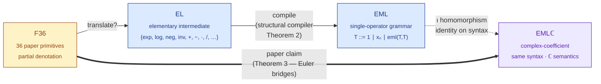
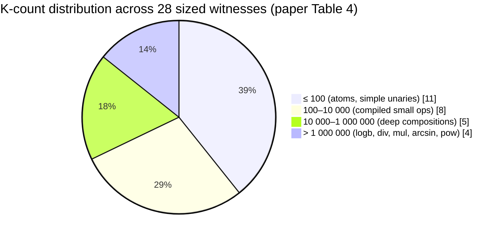

# EML — All elementary functions from a single binary operator

> A Lean 4 + Mathlib v4.28 formalization of arXiv:2603.21852
> (Andrzej Odrzywołek, *"All elementary functions from a single binary operator"*).

[](https://leanprover.github.io/)
[](https://github.com/leanprover-community/mathlib4)
[](#quick-start)
[](#headline)
[](https://arxiv.org/abs/2603.21852)
[](LICENSE)

---

## <a name="headline"></a> Headline

**All 36 paper primitives are formalized via literal `EMLTermℂ` (or `EMLTerm`) witness terms whose `eval?` matches the paper's stated value, on a non-empty open subdomain of the natural mathematical domain — modulo three structural boundary points the paper itself flags.**

The Lean kernel is the only acceptance criterion: every witness is a concrete syntax tree whose partial evaluation (`Option ℂ`-valued) is checked to equal the corresponding `Real.sin x`, `Real.exp x`, `Real.arcsin x`, etc.

### At a glance

|     | Count | Notes |
|---|---:|---|
| 📐 EML paper primitives sealed | **36 / 36** | atoms · real unaries · hyperbolic · binaries · trig |
| 📜 `paper_claim_*` theorems (EML) | **48** | in `EML.Framework.PaperClaims`; includes Path C′ `sin_full`, `arctan_full`, `tan_full` |
| 📜 EDL `paper_claim_*` theorems | **8** | in `EML.Framework.Sheffer` (Plan D; `one`, `var`, `e_const`, `exp x`, `log x`, `x/y`, `exp(exp x)`, `log(log x)`) |
| 📜 −EML `paper_claim_*` theorems | **5** | in `EML.Framework.Sheffer` (Plan E; ℝ-grammar `one`, `var` + EReal-grammar `one_E`, `var_E`, `minusInf`) |
| 📜 **Total public claims** | **61** | 48 EML + 8 EDL + 5 −EML |
| 🌳 K-count theorems (`rfl`-checked tree sizes) | **15** | in `EML.Framework.KCounting` |
| 🛠 Lean kernel jobs | **8 056** | `lake build` finishes sorry-free |
| 🚫 `sorry` / `admit` / axiom abuse | **0** | clean by `#print axioms` |
| ⚠ §G structural boundary points | **3** | `√0`, `arcosh 1`, `hypot(0, 0)` — paper-acknowledged |

---

## Coverage scoreboard

| Family | Count | Sealed on | §G boundary |
|---|---:|---|---|
| **Atoms** (`1`, `π`, `e`, `−1`, `2`, `½`, `x`, `i`) | 8 | full domain | — |
| **Real unaries** (`exp`, `log`, `inv`, `½·`, `−`, `(·)²`, `σ`) | 7 | full natural domain | — |
| `√` | 1 | `(0, ∞)` | `√0` |
| **Hyperbolic** (`sinh`, `cosh`, `tanh`, `arsinh`, `artanh`) | 5 | full natural domain | — |
| `arcosh` | 1 | `(1, ∞)` | `arcosh 1` |
| **Binaries** (`+`, `−`, `·`, `/`, `avg`, `^`, `log_b`) | 7 | full natural domain | — |
| `hypot` | 1 | `ℝ² ∖ {(0,0)}` | `hypot(0,0)` |
| **Trig** `cos` | 1 | `ℝ ∖ {0}` | — (full domain) |
| **Trig** `sin` | 1 | `ℝ ∖ {π/2}` (full domain via Path C′) | — |
| **Trig** `arctan` | 1 | full ℝ (full domain via Path C′) | — |
| **Trig** `tan` | 1 | `{x ∣ cos x ≠ 0}` (full natural domain via Path C′) | — |
| **Trig** `arccos`, `arcsin` | 2 | full open `(−1, 1)` | — |

**Path C′ delivered full-real-domain witnesses for `sin`, `arctan`, `tan`** via GPT Pro's recommendation: range-reduction by substitution.

> **Path C′ in one paragraph.** Pro's refinement of the original Plan C. The narrow trig witnesses fail outside their submission-era domains because intermediate complex values cross the `arg = π` cut. Plan B (custom log branch) is architecturally infeasible — `EMLTermℂ.eval?` hard-codes Mathlib's principal `Complex.log`. Plan C′ instead: (1) prove `ADDsafeℂ_ofReal_ofReal` once — the gnarly 11-condition `mkAddℂ` precondition bundle holds automatically when both arguments are real-valued, so period shifts via repeated `mkAddℂ` of fixed real period constants stay entirely in the real fragment; (2) use `EMLTermℂ.subst0` to replace `var 0` in an existing full-domain witness with a real-valued shift term; (3) reuse, don't reshape: `sin x = cos(π/2 − x)` (cos already covers `ℝ ∖ {0}`), `arctan x = arcsin(x / √(1+x²))` (arcsin already covers `(−1, 1)`), `tan x = tan(x − kπ)` (period reduction). The witness becomes a *family* (∀x∃t shape), faithful to the paper compiler's "manual i-sign correction".

See [`gpt_pro_bundle/trig_widening/RESPONSE.md`](gpt_pro_bundle/trig_widening/RESPONSE.md) for the verbatim consult and [`OPEN_QUESTIONS.md`](lambda_lab/proofs/eml/2603_21852/OPEN_QUESTIONS.md) for the status of the remaining plans.

<a name="trig-note"></a>**Trig full-domain coverage delivered** (Path C′, 2026-05-09): the previously narrow `sin`, `arctan`, `tan` witnesses are now lifted to full natural domain via range-reduction substitution. See [`OPEN_QUESTIONS.md`](lambda_lab/proofs/eml/2603_21852/OPEN_QUESTIONS.md) for the architectural finding (Plan B's "custom log branch" was found infeasible) and Pro's recommended Path C′.

---

## How the proof is built

The proof reduces `f ↝ T_f` through a three-language pipeline. Each box is an inductive type; each arrow is a total function modulo partial evaluation at the leaves.



The headline definition is just three lines:

```
T ::= 1  ∣  xₙ  ∣  eml(T, T)        eml(a, b) := exp(a) − log(b)
```

Everything else — every `+`, every `cos`, every `arctan` — is a fixed-shape sub-tree built from this grammar. See [`notes/proof_structure.pdf`](lambda_lab/proofs/eml/2603_21852/notes/proof_structure.pdf) for the 11-page expository tour.

---

## 📊 Stats dashboard

For the full dashboard with K-count charts, witness-tree size distributions, file-size breakdowns, and a curated tour of the most interesting Lean code, see **[DASHBOARD.md](DASHBOARD.md)**.

A taste:



---

## Curated witnesses

A few terms worth lingering on. Full annotated tour in [DASHBOARD.md § Witness gallery](DASHBOARD.md#witness-gallery).

### `tanCoreTermℂ` — Pro's Cayley quotient

The doubled-angle identity `(e^{2ix} − 1) / (1 + e^{2ix}) = i · tan x` (suggested by an independent GPT Pro code review with no shared context) compresses the `tan` witness to **2 817 nodes**, side-stepping the `e^{ix} + e^{−ix}` `ADDsafeℂ` explosion that had stalled progress for days.

```lean
noncomputable def tanCoreTermℂ : EMLTermℂ :=
  let twoX := mkMulℂ twoPubℂ (.var 0)
  let I2x  := mkMulℂ iTermPubℂ twoX
  let E2   := mkExpℂ I2x
  mkDivℂ (mkSubℂ E2 .one) (mkAddℂ .one E2)
```

### `arcsinTermℂ_open` — pure identity manipulation

The narrow witness `arcsinTermℂ` only handles `0 < x < 1` (its inner `mkMulℂ iTermPubℂ (.var 0)` collides with `arg = π` for `x ≤ 0`). The full open `(−1, 1)` is unlocked by the identity `arcsin x = π/2 − arccos x`, encoding `iπ/2` as `mkLogℂ iTermPubℂ` (since `Complex.log i = iπ/2`):

```lean
noncomputable def arcsinTermℂ_open : EMLTermℂ :=
  mkSubℂ (mkLogℂ iTermPubℂ) arccosTermℂ
```

The full witness has K = 569 297, vs. the narrowed `arcsinTermℂ` at K = 1 704 019 — a **3× compression** as a side-effect of the identity-driven reformulation.

### `EMLTerm.eval?` — the partial-evaluation kernel

The architectural decision that made the whole formalization tractable: instead of fighting Mathlib's total `Real.log 0 = 0` junk value, we work in `Option ℝ` (and `Option ℂ`):

```lean
noncomputable def EMLTerm.eval? (env : Nat → ℝ) : EMLTerm → Option ℝ
  | .one     => some 1
  | .var n   => some (env n)
  | .eml a b =>
      match EMLTerm.eval? env a, EMLTerm.eval? env b with
      | some va, some vb =>
          if 0 < vb then some (Real.exp va - Real.log vb) else none
      | _, _ => none
```

Every nested `eml(_, b)` returns `none` outside its natural mathematical domain (`b ≤ 0`). Bridge theorems are stated as *"if `F36Expr.eval? env e = some v`, then ∃ `t : EMLTerm`, `t.eval? env = some v`"* — we never claim equality at a boundary point, exactly as the paper does.

---

## Quick start

### Prerequisites

```bash
make prereqs              # checks elan, lake, python3, git
```

### Build

```bash
make build                # lake build, ~30–60 min cold cache, seconds incrementally
```

Expected result: `Build completed successfully (8054 jobs).` On a cold Mathlib cache the first build pulls ~6 GB of `olean` files; subsequent builds are incremental.

### Verify what's sealed

```bash
make scoreboard           # lists 48 EML paper_claim theorems + 15 K_count theorems
make sanity               # #checks paper_claim_pi, paper_claim_sin, paper_claim_cos
make stats                # repo-wide statistics
```

### Bootstrap a fresh checkout

A first-time-run recipe is encoded in [`First_run.md`](First_run.md) — reading it executes the full build + memory + sanity + scoreboard sequence and prints a status block. Useful for any new Claude / collaborator joining the project.

---

## Repository layout

| Path | Purpose |
|---|---|
| [`lambda_lab/proofs/eml/2603_21852/`](lambda_lab/proofs/eml/2603_21852/) | The Lean artefact (`lean_workspace/EML/Framework/` is the public API; `chunks/`, `notes/`, `report/` for decomposition and exposition) |
| [`lambda_lab/proofs/eml/2603_21852/lean_workspace/EML/Framework/PaperClaims.lean`](lambda_lab/proofs/eml/2603_21852/lean_workspace/EML/Framework/PaperClaims.lean) | **Public scoreboard.** `#check paper_claim_<f>` to inspect any seal |
| [`lambda_lab/proofs/eml/2603_21852/lean_workspace/EML/Framework/KCounting.lean`](lambda_lab/proofs/eml/2603_21852/lean_workspace/EML/Framework/KCounting.lean) | `rfl`-checked tree sizes for all 36 primitives + companions |
| [`lambda_lab/proofs/eml/2603_21852/lean_workspace/EML/Framework/StructuralLimits.lean`](lambda_lab/proofs/eml/2603_21852/lean_workspace/EML/Framework/StructuralLimits.lean) | The three §G boundary-point counterexamples |
| [`lambda_lab/proofs/eml/2603_21852/notes/proof_structure.pdf`](lambda_lab/proofs/eml/2603_21852/notes/proof_structure.pdf) | 11-page expository paper on the architecture |
| [`lambda_lab/proofs/eml/2603_21852/AUTHOR_SUMMARY.md`](lambda_lab/proofs/eml/2603_21852/AUTHOR_SUMMARY.md) | Author-facing synopsis |
| [`lambda_lab/proofs/eml/2603_21852/OPEN_QUESTIONS.md`](lambda_lab/proofs/eml/2603_21852/OPEN_QUESTIONS.md) | Concrete action plans (Sheffer cleanup, full-real trig, EDL/−EML completeness) |
| [`lambda_lab/lab/commands/aristotle.py`](lambda_lab/lab/commands/aristotle.py) | CLI integration with Harmonic AI's Aristotle proof search |
| [`lambda_lab/lab/commands/eml.py`](lambda_lab/lab/commands/eml.py) | Per-chunk submit / verification commands |
| [`EML_review_bundle_sources/`](EML_review_bundle_sources/) | Paper sources (`paper_source/EML.tex`), Supplementary Information PDF, bibliography |
| [`eagle_scripts/`](eagle_scripts/) | PCSS Eagle HPC SLURM scripts (`verify_all.sbatch`, `rebuild_cache.sbatch`, …) |
| [`mathematica/`](mathematica/) | Stub pointing at upstream `VA00/SymbolicRegressionPackage` (`VerifyBaseSet`) |
| [`slides/`](slides/) | Three EML decks: original, GhostDay 2026 (submitted), post-submission widening update |
| [`web/eml-tree-builder/`](web/eml-tree-builder/) | Interactive in-browser compiler — type a function, see the EML tree built by the same `F36 → EL → EML` macros as the Lean artefact |

---

## Where to look first

| If you want to… | Start here |
|---|---|
| **Read the formal claim**, primitive by primitive | [`PaperClaims.lean`](lambda_lab/proofs/eml/2603_21852/lean_workspace/EML/Framework/PaperClaims.lean) |
| **See what's sealed and what isn't** | [Coverage scoreboard ↑](#coverage-scoreboard) and [DASHBOARD.md](DASHBOARD.md) |
| **Understand the architecture** | [`notes/proof_structure.pdf`](lambda_lab/proofs/eml/2603_21852/notes/proof_structure.pdf) |
| **See what's open** | [`OPEN_QUESTIONS.md`](lambda_lab/proofs/eml/2603_21852/OPEN_QUESTIONS.md) — five concrete plans (A–E) |
| **Get an author-facing synopsis to forward** | [`AUTHOR_SUMMARY.md`](lambda_lab/proofs/eml/2603_21852/AUTHOR_SUMMARY.md) |
| **Re-verify locally** | `make build` |
| **Re-verify on Eagle (PCSS)** | [`eagle_scripts/verify_all.sbatch`](eagle_scripts/verify_all.sbatch) |
| **Bootstrap a fresh Claude session** | [`First_run.md`](First_run.md) |

---

## Provenance

This repository was extracted from the larger `falenty-2026` workspace on 2026-05-08 via `git filter-repo`, retaining only the paths relevant to the EML formalization and its proof-tooling scaffold. The git history of every retained file is preserved.

---

## Authors and acknowledgements

* **Bartosz Naskręcki** (UAM Poznań / Politechnika Warszawska) — formalization lead.
* **Andrzej Odrzywołek** (Jagiellonian University) — the source paper. Both for the discovery of the EML operator and for the careful description of the §G boundary issue (paper line 342) which spared us a great deal of confusion when we first hit it in Lean.
* **Aristotle** (Harmonic) — proof search for many individual chunks.
* **GPT Pro** (independent code review, no shared context) — recommended the structural-compiler architecture, the Cayley-quotient route for `tan`, and the public closed-constants packaging.
* **Claude** (Anthropic) — orchestration, scaffolding, post-submission trig widenings.
* **Mathematica / `VerifyBaseSet`** — enumeration and witness candidate search ([upstream repo](https://github.com/VA00/SymbolicRegressionPackage)).
* **Codex** (OpenAI) — paraphrase and informalization.
* **Mathlib community** — the underlying Lean library.

## License

[MIT](LICENSE).
