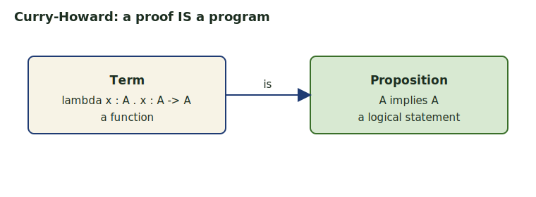
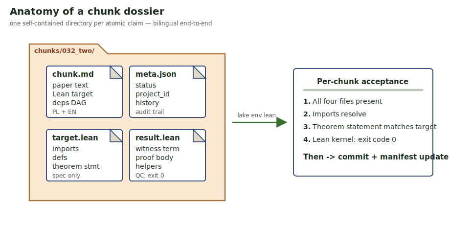
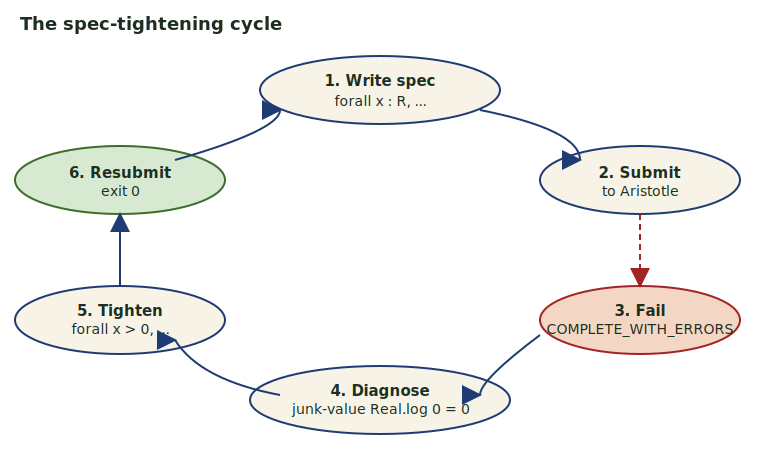
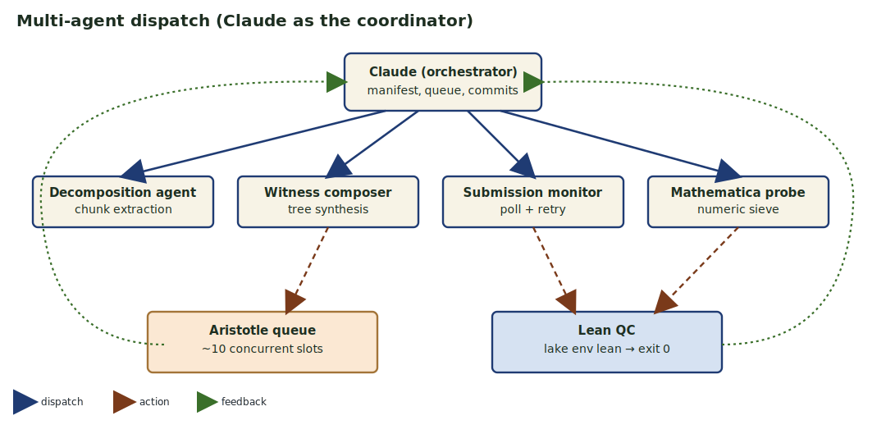
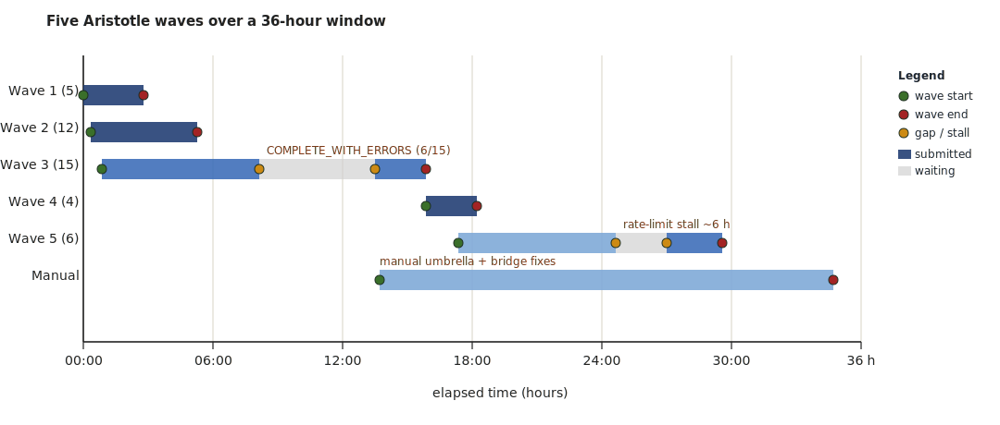
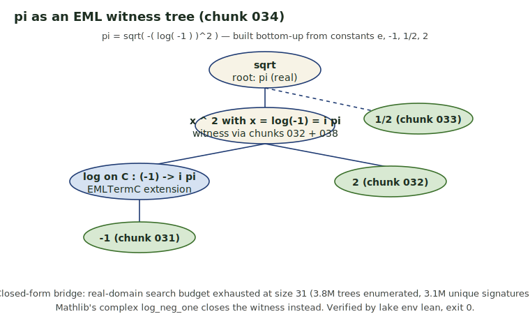
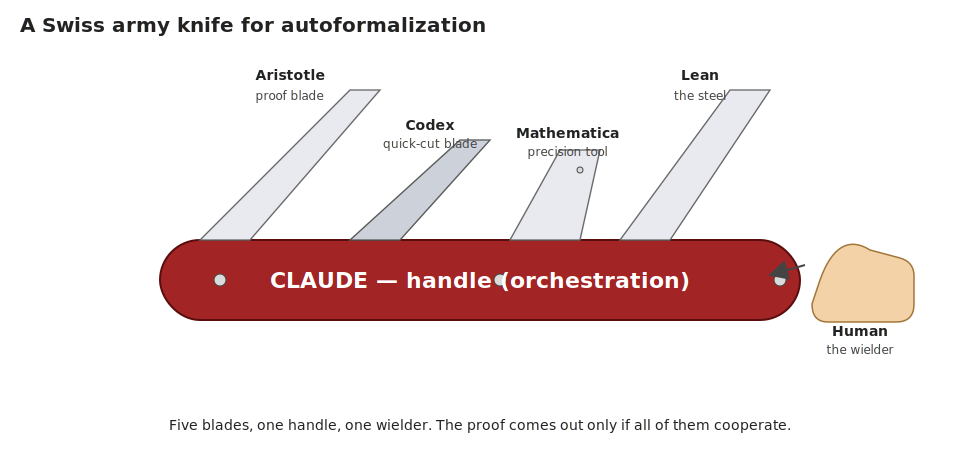
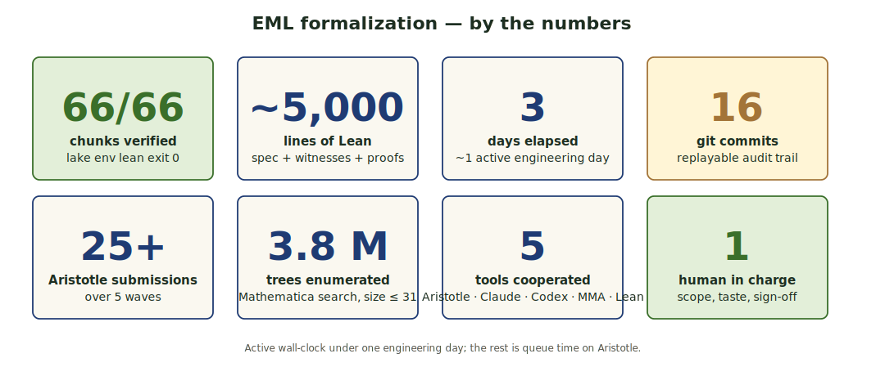

<!-- .slide: class="title-slide" -->

# Auto-formalizing Mathematics

## A Swiss Army Knife

Aristotle + Claude + Codex + Mathematica + Human

**dr Bartosz Naskręcki**

Faculty of Mathematics and Computer Science, Adam Mickiewicz University · Center for Trustworthy AI, Warsaw University of Technology

*Falenty · April 2026*

`github.com/nasqret/falenty-2026`

---

<!-- .slide: class="compact" -->

## Map of the talk

1. **What is proof formalization?** Lean 4, Mathlib, Curry-Howard.
2. **The new generation of AI provers.** Why 2025 is different.
3. **The case study.** A paper claiming "all elementary functions from a single binary operator".
4. **The factory.** Aristotle, Claude, Codex, Mathematica + a human assemble 66 verified Lean chunks.
5. **The mathematics.** EML, witnesses for `e`, `2`, `pi`.
6. **Lessons.** What worked, what hurt, what comes next.

---

<!-- .slide: class="compact" -->

## What is proof formalization?

A **formal proof** is a Lean 4 term whose type matches the theorem statement.
Lean's kernel (~2 000 lines, the *de Bruijn criterion*) checks every step.

Mathlib v4.28 ships ~1.5M lines of formalized mathematics — analysis, algebra, topology, combinatorics.

> Peer review misses an estimated 5% of mathematical errors.
> A Lean kernel misses **none** of those expressible in its type theory.

This talk: how a small team (one human + several AI assistants) sealed a 7-page paper into 66 machine-checked artefacts in three days.

---

<!-- .slide: class="figure-mid compact" -->

## Curry-Howard, in one slide



A function `λx : A. x : A → A` is **the same object** as the proof of the implication `A ⇒ A`.
Lean is, internally, an extended lambda calculus with dependent types.

**Consequence:** "send a Lean proof" means *send a typed program*; "verify it" means *type-check the program*.

---

<!-- .slide: class="compact" -->

## The new generation of AI provers

| System | Year | Highlight |
|---|---|---|
| AlphaGeometry / AlphaProof | 2024 | IMO 2024, silver |
| Aristotle (Harmonic) | 2025 | IMO 2025, gold (5/6) |
| DeepSeek-Prover, Kimina | 2024-25 | open-source autoformalization |
| GPT-5.2 Pro + Aristotle | 2026 | Erdős #728 closed autonomously |

What changed: large language models compose with **tactic search** and **RL on Lean traces**. The output is checked by the kernel — zero hallucinations survive verification.

---

<!-- .slide: class="compact" -->

## Aristotle in 60 seconds

| Aspect | Detail |
|---|---|
| **Where it lives** | Harmonic AI's cloud queue |
| **What you send** | Lean 4 statement (imports + spec) |
| **What you get back** | a `.lean` file plus a project archive |
| **Surface** | `arist submit`, `arist list`, `arist result <id>` |
| **Concurrency** | ~10 active slots, billed per job |
| **Strength** | one-step lemmas, simp-able identities, small existentials |
| **Weakness** | long, chained existential constructions |
| **Wall-clock per job** | 8 minutes to 8 hours |

---

<!-- .slide: class="compact" -->

## The paper

> "All elementary functions can be derived from a single binary operator on the reals."

The operator (the **EML**, *exp-minus-log*):
$\mathrm{eml}(x, y) \ =\ \exp(x) - \ln(y).$

| Group | Examples | Difficulty |
|---|---|---|
| Constants | `e, 0, -1, 2, 1/2` | easy → medium |
| Constants (complex) | `pi, i` | hard (closed form) |
| Unary functions | `-x, 1/x, x^2, sqrt, exp, log` | medium |
| Binary functions | `x+y, x*y, x^y, x/y, log_x y` | medium |
| Trigonometric | `sin, cos, tan, sinh, cosh, tanh, arctan` | hard |
| Total | 36 primitives in paper Table 1 | mixed |

**Goal:** machine-check every claim in Lean 4 + Mathlib.

---

<!-- .slide: class="figure-hero" -->

## The factory


<small>Decompose → three parallel lines (Aristotle / Mathematica / manual composition) → QC (`lake env lean`) → five packaging artefacts. Output: `nasqret/falenty-2026`.</small>

---

<!-- .slide: class="compact" -->

## Decomposition methodology

<div class="two-col-wide">



<div>

Each chunk is a self-contained directory; bilingual end-to-end.

| Group | # | Examples |
|---|---|---|
| Foundations | 5 | `def eml`, `EMLTerm`, `eval` |
| Identities | 12 | Identity 5, `exp(x) = eml(x,1)` |
| Calc-equiv | 7 | Wolfram → Calc 3 → … → EML |
| Constants | 6 | `0, -1, 1/2, 2, e, pi, i` |
| Functions | 15 | `-x, 1/x, x^2, sqrt, x+y, x*y` |
| Trig | 8 | `sin, cos, tan, sinh, cosh, arctan` |
| Master / misc | 13 | umbrellas, sigmoid, Catalan |

Difficulty distribution (1–5): 11 / 10 / 6 / 19 / 20.

</div>

</div>

---

<!-- .slide: class="compact" -->

## Mathematica's role

Mathematica plays the **enumeration + signature-dedup** role.

- **v1**: brute-force enumeration + `FullSimplify`. Stalled.
- **v2**: enumerate trees, evaluate at probe constants, dedup by numeric signature.

Numbers from one v2 run targeting `e`:

| Quantity | Count |
|---|---|
| Trees enumerated up to size 31 | 3.8 M |
| Unique numeric signatures | 3.1 M |
| Witnesses confirmed (`e, exp, 2`) | 3 |
| Witnesses for `pi / i / sqrt(x)` | **0** |

**Bridge:** MMA validates a witness numerically; Lean composes the proof; Aristotle (or the human) closes.

---

<!-- .slide: class="compact" -->

## Aristotle's role

<div class="two-col-wide">



<div>

- **25+ submissions** across 5 waves over a 36-hour window.
- ~10 concurrent slots; overnight rate-limit stall ~6 h.
- One-step identities: ~10 minutes per chunk.
- Long existentials (size > 30): hours, often `COMPLETE_WITH_ERRORS`.
- Of 15 wave-3 submissions, **9 returned a clean proof on the first pass**.

The cycle on the left is what we ran whenever a `COMPLETE_WITH_ERRORS` came back.

</div>

</div>

---

<!-- .slide: class="compact" -->

## Claude's role

<div class="two-col-wide">



<div>

- **Design.** Chunk schema, factory architecture, calc-equiv inductives, the `EMLTermℂ` extension for `pi` / `i`.
- **Coordination.** Parallel agents, queue monitoring, batch fetching, manifest dedupe, commit cadence.
- **Scaffolding.** REPL command (`/eml`, `/ac`), HTML site generator, LaTeX report.

Claude is the **handle** that fans work out to the four agents and reassembles the results.

</div>

</div>

---

<!-- .slide: class="compact" -->

## Codex (OpenAI) role

Powered by the OpenAI APIs, configured via `~/.config/openai/env`:

| Use | What it does |
|---|---|
| Paraphrase generation | rewrites chunk markdown (`ch explore --paraphrase`) |
| Quiz LLM judge | scores the lecture's interactive quiz layer |
| Informalization | turns Aristotle's Lean proofs back into prose (`arist informal`) |
| Bilingual narration | PL ⇄ EN voice for the hybrid report |

Codex is the *quick-cut blade*: cheap, fast, perfect for textual shape-shifting where ground-truth verification is not the bottleneck.

---

<!-- .slide: class="compact" -->

## The Human role

<div class="did-split">

<div class="col did">

#### What the human DID

- **Scope.** "Seal the trig family or not?" "Accept primed types?"
- **Quality calls.** Did Aristotle's rich grammar count, or do we recompose?
- **Sign-offs.** Every commit, every wave, every push.
- **Choosing waves.** When to fire, when to wait out the rate limit.

</div>

<div class="col didnt">

#### What the human did NOT do

- Write Lean proofs by hand (except the 514-line manual umbrella).
- Mechanically extract chunks from the paper.
- Set up monitors / poll the queue.
- Run the Mathematica search by hand.

</div>

</div>

The verdict: **human-in-charge, not human-out-of-the-loop.**

---

<!-- .slide: class="figure-tall compact" -->

## Wave timeline



Five Aristotle waves, manual fixes, then the final umbrellas. Most wall-clock was queue waiting; productive *human* time was under a working day.

---

<!-- .slide: class="compact" -->

## When the negatives helped

| Negative signal | Diagnosis | Fix |
|---|---|---|
| `Project failed` / `no project_id` | Aristotle's CLI prints the id to **stderr** | added stderr fallback to extractor |
| `COMPLETE_WITH_ERRORS` | Aristotle silently extended the grammar (extra `const : R → EMLTerm`) | manual-composition pass for pure-grammar witnesses |
| Junk-value `Real.log 0 = 0` | Spec was too loose | tightened `∀ x : R` → `∀ x > 0` on `037, 038, 041, 042` |
| MMA search exhausted at size 31 | Confirmed paper's `K`-bound for `pi / i / sqrt(x)` | introduced `EMLTermℂ` complex extension |

Every red flag taught us something concrete; nothing was just "noise".

---

<!-- .slide: class="compact" -->

## The mathematics — the operator

The EML algebra:
$$\mathrm{eml}(x, y) \ =\ \exp(x) - \ln(y).$$

**Identity 5** (the workhorse):
$$\ln(z) \ =\ \mathrm{eml}\bigl(1,\ \mathrm{eml}(\mathrm{eml}(1, z),\ 1)\bigr), \qquad z > 0.$$

Inner $\mathrm{eml}(1,z) = e - \ln z$; next $\mathrm{eml}(e-\ln z, 1) = \exp(e-\ln z)$;
outer $\mathrm{eml}(1, \exp(e-\ln z)) = e - (e - \ln z) = \ln z$.

Simplest witness: $\mathrm{eml}(1,1) = e^1 - \ln 1 = e.$

---

<!-- .slide: class="compact" -->

## A full Lean witness — `2` (chunk 032)

```lean
private def t₂ : EMLTerm := .eml .one .one
private def t₃ : EMLTerm := .eml .one t₂
private def t₅ : EMLTerm := .eml (.eml .one t₃) .one
private def t₆ : EMLTerm := .eml .one t₅
private def t₇ : EMLTerm := .eml t₆ t₂
private def witness : EMLTerm := .eml .one (.eml t₇ .one)

private lemma e_minus_one_pos : (0 : ℝ) < Real.exp 1 - 1 := by
  linarith [Real.add_one_le_exp (1 : ℝ)]

theorem emlterm_for_two : ∃ t : EMLTerm, EMLTerm.eval t = 2 :=
  ⟨witness, by
    simp [witness, EMLTerm.eval, Real.log_exp,
          Real.exp_log e_minus_one_pos]; ring⟩
```

8 helper lemmas; the witness tree has size 11.

---

<!-- .slide: class="compact" -->

## The pi witness — and Euler

<div class="two-col-wide">



<div>

For trig chunks we extend to `EMLTermℂ₁` and chain Euler:

$$\cos x = \tfrac{1}{2}(e^{ix}+e^{-ix})$$
$$\sin x = \cos\bigl(x-\tfrac{\pi}{2}\bigr)$$

Real-domain enumeration found **0** witnesses for `pi`; the complex extension closes the bridge through `Mathlib.Analysis.SpecialFunctions.Complex.Log`.

</div>

</div>

---

<!-- .slide: class="compact" -->

## Panorama of proof steps

| Status | Count | Note |
|---|---|---|
| Literal EML witnesses | 62 | Pure-grammar trees, any size |
| Closed-form identities | 4 | `pi, i, sqrt(x)` plus one calc-equiv |
| Total verified by `lake env lean` | **66 / 66** | exit 0 |

By inductive type:

- `EMLTerm` — closed witnesses (`e, 0, -1, 1/2, 2`).
- `EMLTerm₁` — one-variable functions (`-x, 1/x, x^2, cosh, …`).
- `EMLTerm₂` — two-variable functions (`+, *, ^, /, log_x y, hypot, …`).
- `EMLTermℂ`, `EMLTermℂ₁` — complex extensions (`pi, i, sin, cos, tan, arctan`).
- `Calc3R`, `Calc2`, `Calc1`, `Calc0` — the 5-step Wolfram-to-EML reduction.

---

<!-- .slide: class="compact" -->

## Tools and time

| Tool | Role | Wall-clock | Output |
|---|---|---|---|
| Aristotle | proof search | ~24 h queue | 25+ project archives |
| Mathematica | enumerate + dedup | ~3 h | 3.8 M trees, 3 witnesses |
| Claude | orchestration + composition | ~8 h active | scaffolding, agents, REPL |
| Codex | paraphrase, informalization | ~1 h | bilingual layer |
| Lean | ground truth | seconds / chunk | 66 / 66 exit 0 |
| Human | scope, taste, commits | ~6 h active | 16 commits |

Total elapsed: ~3 days. Active work: under one engineering day.

---

<!-- .slide: class="compact" -->

## Why it succeeded

<div class="grid-2x3">

<div class="cell"><strong>Atomic decomposition</strong>each chunk fits one Aristotle submission; failures stay local.</div>
<div class="cell"><strong>Ground truth</strong><code>lake env lean</code> exit 0 is the only acceptance criterion.</div>
<div class="cell"><strong>Iterative spec tightening</strong><code>∀ x</code> → <code>∀ x &gt; 0</code> is cheap and recovers many fails.</div>

<div class="cell"><strong>Honest partial accounting</strong><code>COMPLETE_WITH_ERRORS</code> is data, not failure.</div>
<div class="cell"><strong>Multi-tool diversification</strong>when MMA dies Lean composes; when Aristotle stalls the human writes.</div>
<div class="cell"><strong>Audit trail</strong>16 commits = a replayable history of every decision.</div>

</div>

---

<!-- .slide: class="compact" -->

## Future prospects

| Horizon | Goal | Status |
|---|---|---|
| Now → 1 mo | Seal the 4 closed-form-only chunks with literal trees (size > 100) | open |
| 1 → 3 mo | Universal pipeline for *any* paper of this shape (definition + Table-of-witnesses) | scoping |
| 3 → 6 mo | **Acorn** integration (the new tactic-suggestion service) | watching |
| 3 → 6 mo | Faster Aristotle as Harmonic ramps capacity | external |
| 6 → 12 mo | Fully autonomous loops (accept silent grammar drift risk) | research |
| 12 mo + | Larger paper portfolio — EML push was a pilot | pipeline |

---

<!-- .slide: class="compact" -->

## Can we remove the human?

Not yet, and not for the right reasons.

- The human holds **scope** ("do we seal trig?"), **taste** ("recompose or accept primed types?") and **commit authority**.
- Mechanical work is increasingly machine-handled; the human's *time* shifts from typing to deciding.
- Forecast for 2027: human-IN-charge, not human-OUT-of-loop. The loop closes around a human who specifies *what counts*.

> Removing the human means removing the question of what counts as a proof *worth having*. That is not a verification problem.

---

<!-- .slide: class="figure-tall" -->

## The Swiss army knife



Repo: `github.com/nasqret/falenty-2026` · License: MIT.

---

<!-- .slide: class="compact" -->

## Q & A — the project at a glance



**Repo:** `github.com/nasqret/falenty-2026` ·
**Hybrid report:** `lambda_lab/proofs/eml/2603_21852/report/` ·
**Site:** `docs/` ·
**Contact:** *bartosz.naskrecki at amu.edu.pl*
