<!-- .slide: class="title-slide" -->

<div class="title-grid">


<div class="title-text">

# Automatic verification of mathematical theorems with AI

*Aristotle + Claude + Codex + Mathematica + GPT Pro + Human*

**dr Bartosz Naskręcki**

Assistant Professor · Adam Mickiewicz University, Poznań

Center for Credible AI · Warsaw University of Technology

*GhostDay · Saturday · 2026* · `github.com/nasqret/eml-formalization`

<div class="title-logos">
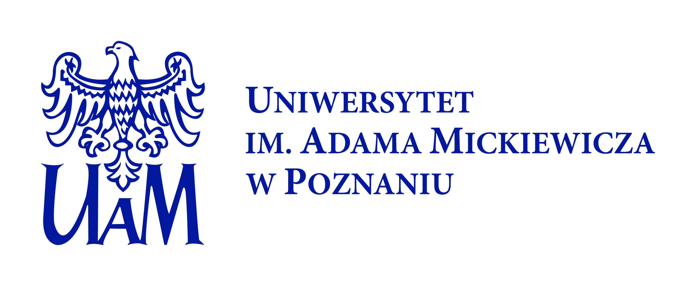

</div>

</div>

</div>

---

<!-- .slide: class="compact" -->

## Map of the talk

1. **The general picture.** What is a mathematical proof, why formalize, type theory, Lean.
2. **Six classic examples.** Four-color theorem, Kepler, Fermat, Robbins, Liquid Tensor, Polynomial Freiman-Ruzsa.
3. **The new generation of AI provers.** AlphaGeometry, AlphaProof, Aristotle, Kimina.
4. **Erdős problems and the blueprint era.** GPT × Aristotle, LeanArchitect, the Equational Theories Project.
5. **Case study — the EML factory.** A 7-page paper sealed by a small AI factory.
6. **The audit loop.** Why a *second* LLM family reviewing pushed the project from a witness catalogue to a structural compiler.
7. **The future of the mathematician.** Human-in-charge, not human-out-of-loop.

---

<!-- .slide: class="section-divider" -->

# 1. The general picture

---

<!-- .slide: class="compact" -->

## What is a mathematical proof?

A formal proof, modern view, is a typed term whose type matches the theorem statement. The kernel checks every step.

Sketch of a proof of *infinitude of primes* (Euclid, ~300 BC):

> Suppose finitely many primes $p_1, \ldots, p_n$ exist. Consider $N = p_1 \cdots p_n + 1$. Then $N$ has a prime divisor $q$, and $q$ cannot equal any $p_i$ (it would divide the difference 1). Contradiction.

Three eras of formality:
- **Pre-1900** — proof = a convincing chain of reasoning, evaluated by community.
- **1900–2000** — Hilbert's program, Gödel, Church, AUTOMATH (de Bruijn, 1968).
- **2000–** — modern interactive proof assistants: Coq, Isabelle, **Lean 4 + Mathlib**.

> Peer review is social and fallible. A kernel checks every accepted formal step relative to the axioms and definitions in scope.

---

<!-- .slide: class="compact" -->

## A century-old idea: type theory

| Year | Step |
|---|---|
| 1908 | Bertrand Russell, *Mathematical Logic Based on the Theory of Types* |
| 1930s | Alonzo Church, untyped lambda calculus → simply-typed |
| 1940s | Curry's combinators; Howard's correspondence (1969 published) |
| 1968 | de Bruijn's **AUTOMATH** — the first proof checker |
| 1972 | Per Martin-Löf, *Intuitionistic Type Theory* — dependent types |
| 1984 | Coquand & Huet's *Calculus of Constructions* → **Coq** |
| 1990s–2000s | HOL, Isabelle, Mizar, Agda |
| 2013 | Leonardo de Moura: **Lean** at MSR |
| 2017– | Mathlib community: ~1.5 M lines of formalized mathematics by 2026 |

The technology powering 2026's AI provers was theoretical groundwork for ~50 years.

---

<!-- .slide: class="figure-mid compact" -->

## Curry–Howard, in one slide

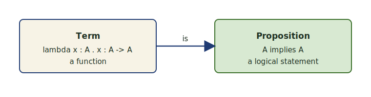

A function `λx : A. x : A → A` is **the same object** as the proof of `A ⇒ A`.
Lean is, internally, an extended lambda calculus with dependent types.

**Consequence:** "send a Lean proof" means *send a typed program*; "verify it" means *type-check the program*.

---

<!-- .slide: class="compact" -->

## The Lean ecosystem in 2026

<div class="two-col-wide">

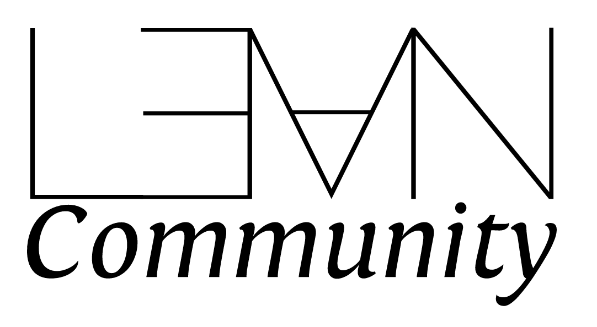

<div>

| Component | Scale |
|---|---|
| **Lean 4 kernel** | ~2 000 lines of trusted code |
| **Mathlib** | ~1.5 M lines, ~25 000 build artefacts |
| **100 theorems** (Wiedijk) | 99/100 across all systems · 84/100 in Lean today |
| **AI prover stack** | Aristotle, AlphaProof, Kimina, DeepSeek-Prover |
| **Active contributors** | hundreds, growing weekly |

Mathematics is starting to face the engineering challenges software has been answering for decades: **scalability**, **reproducibility**, **insight**.

</div>

</div>

---

<!-- .slide: class="compact" -->

## Proofs as reusable commodities

Once a theorem is sealed in Lean, it is a *piece of software*: a typed term that any other formal proof can `import`. Three IT-style challenges follow.

| Challenge | What it looks like in practice |
|---|---|
| **Scalability** | Mathlib v4.28 ships ~1.5 M lines. The next million has to come from a *factory*, not from individual heroes. |
| **Reproducibility** | A one-command build with a pinned toolchain replaces "I checked it on a blackboard." A reviewer in 2030 can press one button and replay the proof. |
| **Insight** | When a proof is a typed term, you can search it, decompose it, refactor it, ask an LLM to summarise it. The artefact stops being write-once. |

---

<!-- .slide: class="section-divider" -->

# 2. Six classic examples

---

<!-- .slide: class="compact" -->

## Four-Color Theorem

<div class="two-col-wide">

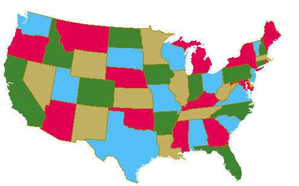

<div>

> *Every planar map can be properly coloured with at most 4 colours.*

| Year | Step |
|---|---|
| 1852 | Conjecture by Francis Guthrie. |
| 1976 | **Appel & Haken** prove it via case-analysis on 1 482 reducible configurations on an IBM 370. *First major proof to depend on a computer.* The community is uneasy. |
| 2005 | **Georges Gonthier**, with Benjamin Werner, formalises the entire proof in **Coq** — every reducible configuration, every check. The result becomes incontestable. |

Gonthier's project established the playbook: **a contested computational proof becomes a settled fact when it is type-checked**.

</div>

</div>

---

<!-- .slide: class="compact" -->

## Kepler's conjecture (Hales' Flyspeck)

<div class="two-col-wide">

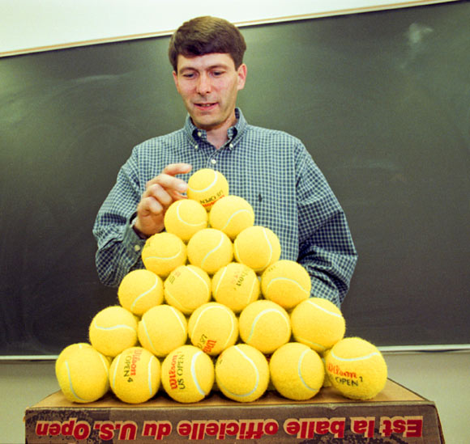

<div>

> *No packing of unit balls in $\mathbb{R}^3$ achieves a higher density than the face-centred-cubic packing* <span style="white-space:nowrap">($\pi / \sqrt{18} \approx 0.74048$).</span>

| Year | Step |
|---|---|
| 1611 | Kepler conjectures the bound. |
| 1998 | **Thomas Hales** announces a proof. ~250 pp + ~3 GB of code. |
| 2003 | *Annals* referees: "99% certain". Hales launches **Flyspeck** to formalise it. |
| 2014 | **Flyspeck** completes — certified in HOL Light + Isabelle, 23 000 lemmas. |

A 16-year project. Today the same scope would land in months, not years, with AI support.

</div>

</div>

---

<!-- .slide: class="compact" -->

## Fermat's Last Theorem (in flight)

<div class="two-col-wide">


<div>

> *For $n > 2$, the equation $x^n + y^n = z^n$ has no solutions in positive integers.*

- **1637** — Fermat's marginal note: *"truly marvellous demonstration … the margin is too narrow"*.
- **1994** — **Andrew Wiles** proves modularity of semistable elliptic curves, closing the gap (with Richard Taylor). 100+ pages.
- **2024–** — **Kevin Buzzard's** Imperial College project: **a full Lean 4 formalisation of Wiles's proof**.

Status (mid-2026): foundational arithmetic and modular forms in Mathlib are extensive; ~30% of the formal scaffolding for Wiles's proof is in place.

> "If we can put a rover on Mars, we can formalise FLT." — K. Buzzard

</div>

</div>

---

<!-- .slide: class="compact" -->

## Robbins conjecture & Liquid Tensor

<div class="two-col-wide">

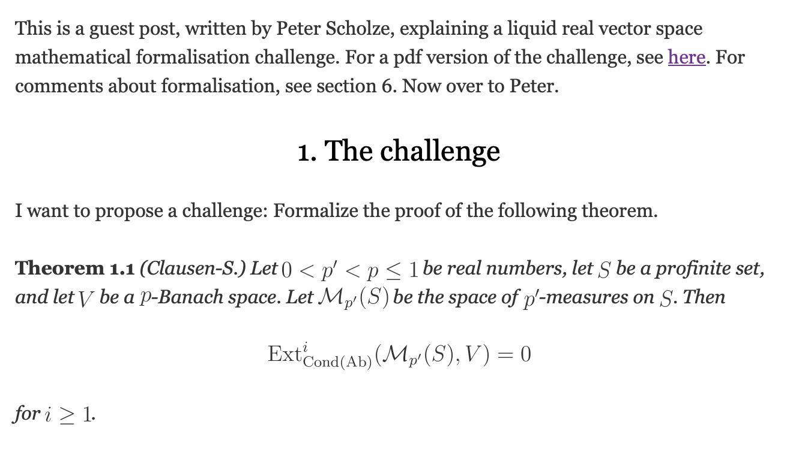

<div>

**Robbins conjecture (1933 → 1996).** *Are Robbins algebras Boolean?*
- Posed by Herbert Robbins. Open for 60 years.
- 1996 — **William McCune's `EQP`** (a first-generation automated theorem prover) finds a proof.
- *First open conjecture solved by a computer.*

**Liquid Tensor Experiment (2020 → 2022).**
- Posted by **Peter Scholze** on Xena Project blog: *"I want to know — by formal verification — that this is correct."*
- ~6 months of community work in Lean 4, led by **Johan Commelin**.
- Confirmed and *clarified* the proof.
- *First contemporary research-math result formalised at the request of its author.*

</div>

</div>

---

<!-- .slide: class="compact" -->

## Polynomial Freiman–Ruzsa & PFR-Plünnecke

<div class="two-col-wide">

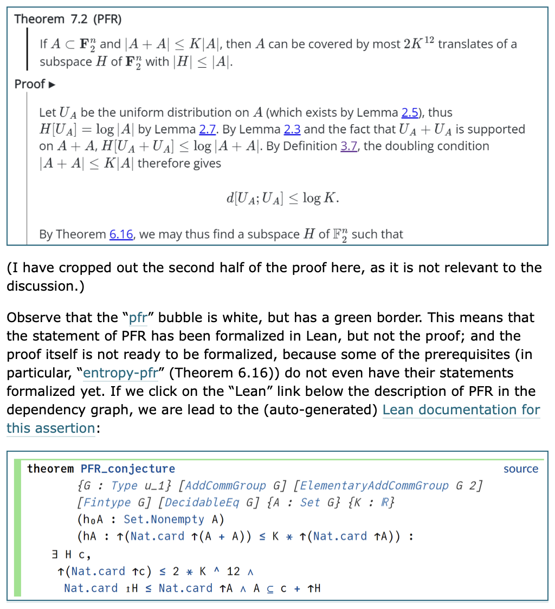

<div>

> *If $A \subseteq \mathbb{F}_2^n$ has doubling $|A+A| \leq K|A|$, then $A$ is contained in a coset of a subgroup of size $\leq K^C |A|$.*

| Year | Step |
|---|---|
| 2012 | Conjectured by Tim Gowers. |
| 2023 | **Tao, Gowers, Green, Manners** post a 30-page proof. |
| 2023–24 | Tao runs a **Lean 4 formalisation** in real time. |
| Nov 2023 | Proof fully formalised — **3 weeks** preprint to Lean-checked. |

Why fast? **Blueprint methodology** — split the proof into a graph of ~1500 small lemmas, dispatch to community + AI provers in parallel.

</div>

</div>

---

<!-- .slide: class="compact" -->

## State of formalization 2026

```
Wiedijk's "100 theorems" list (as of mid-2026):
  formalised across all systems:  99 / 100   (Wiedijk's tracking)
  formalised in Lean 4:           ~84 / 100  (lean-community page)
  flagship in flight:                Fermat's Last Theorem (#33)
                                     — Buzzard's Imperial project,
                                       active since 2024
```

**Mathlib growth**: ~1.5 M lines (2026), doubled in 24 months.

**Recent (2024-2026):**
- IMO 2024 problems formalised within a week of release (AlphaProof, DeepSeek-Prover).
- IMO 2025 problems: 5 of 6 sealed by Aristotle within 24 hours.
- Erdős problems: ongoing dispatch — see next section.

The pace is **accelerating**, not linear.

---

<!-- .slide: class="section-divider" -->

# 3. AI provers in 2026

---

<!-- .slide: class="compact" -->

## AlphaGeometry, AlphaProof, Aristotle, Kimina

| System | Year | Highlight |
|---|---|---|
| **AlphaGeometry** (DeepMind) | 2024 | IMO 2024 geometry problems, gold-medal level |
| **AlphaProof** (DeepMind) | 2024 | IMO 2024, silver — formal Lean proofs |
| **Aristotle** (Harmonic) | 2025 | IMO 2025, **gold (5/6)** — fully formal Lean output |
| **DeepSeek-Prover, Kimina** | 2024-26 | open-source autoformalization + RL on Lean traces |
| **GPT-5.2 Pro + Aristotle** | 2026 | **Erdős #728 closed autonomously** |

**What changed:** large language models compose with **tactic search** and **RL on Lean traces**. The output is checked by the kernel — *zero hallucinations survive verification.*

---

<!-- .slide: class="compact" -->

## Aristotle in 60 seconds

| Aspect | Detail |
|---|---|
| Where it lives | **Harmonic's** cloud queue |
| What you send | Lean 4 statement (imports + spec) |
| What you get | A Lean term (proof) or "COMPLETE_WITH_ERRORS" |
| Concurrency | ~10 simultaneous slots, 6h rate-limit windows |
| Strengths | Single-step lemmas, clever rewrites, library lookup |
| Weaknesses | Long existential constructions, obscure tactics |

**Pipeline:** statement → Aristotle → Lean kernel verifies → result archived. The kernel is the **single source of truth**.

The collaboration with **Harmonic** — the team behind Aristotle — is what made the EML factory possible at this cadence. Their cloud queue, the open API, the willingness to discuss failure modes and `COMPLETE_WITH_ERRORS` semantics, and their generous slot allocation during the project together turned what would have been a months-long manual job into days of orchestrated dispatch.

---

<!-- .slide: class="compact" -->

## Auto-formalization

The other half of the story: turning **prose mathematics into Lean**.

| Stage | Tools |
|---|---|
| LaTeX paper | the human starting point |
| **Decomposition** | LLM (Claude/GPT) splits the paper into atomic chunks: definitions, lemmas, theorems, witnesses |
| **Statement extraction** | LLM produces Lean 4 statements; human signs off on scope |
| **Proof search** | Aristotle / DeepSeek-Prover / human composition |
| **Kernel check** | the Lean kernel — the only thing that matters |

The bottleneck has shifted: from *writing proofs* to *agreeing on what to formalize*.

---

<!-- .slide: class="compact" -->

## A roadmap I co-authored — August 2025

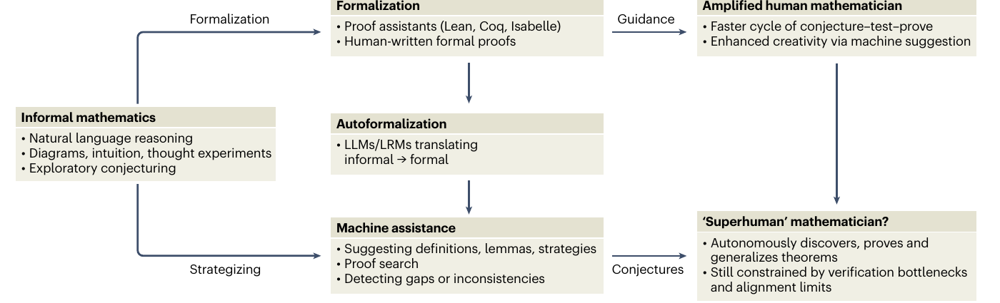

B. Naskręcki & K. Ono, **"Mathematical discovery in the age of artificial intelligence"**, *Nature Physics* (2025) — [doi:10.1038/s41567-025-03042-0](https://doi.org/10.1038/s41567-025-03042-0). Written **August 2025** — six months before this talk. The right-hand "**amplified human mathematician**" is exactly what the remaining sections show *live*: the Erdős dispatch, Nathanson via Aristotle, and the EML factory are the **2026 instantiation** of this prediction. The "superhuman mathematician" arrow still points at *future* — but the gap is closing.

---

<!-- .slide: class="section-divider" -->

# 4. Erdős & the blueprint era

---

<!-- .slide: class="compact" -->

## erdosproblems.com — open Erdős conjectures

<div class="two-col-wide">

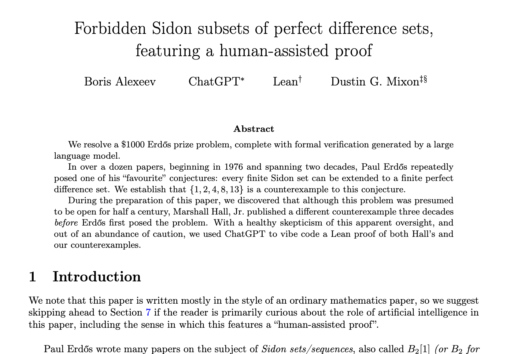

<div>

Thomas Bloom maintains [erdosproblems.com](https://erdosproblems.com): a curated list of Paul Erdős's ~600+ open conjectures.

**2026: AI provers join the dispatch.**

| Erdős | Status |
|---|---|
| **#339** | Resolved 2025 by GPT-5 + classical reasoning |
| **#728** | **Closed autonomously by GPT-5.2 Pro + Aristotle**, 2026 |
| **#768, #813** | Active dispatch |
| Sidon subsets | *Forbidden Sidon subsets of perfect difference sets, featuring a human-assisted proof* (Alexeev, ChatGPT, Lean, Mixon, 2025) |

*human poses problem → LLM proposes plan → Aristotle finds Lean proof → community ratifies*. **Erdős's posthumous research programme is being run by AI assistants.**

</div>

</div>

---

<!-- .slide: class="compact" -->

## Pietro Monticone — autonomous math discovery

<div style="display:grid; grid-template-columns: 1fr 200px; gap: 1.4em; align-items: start;">

<div>

**[arXiv:2604.18869](https://arxiv.org/abs/2604.18869)** — *Global Product Intersection Sets in Semigroups* (van Doorn · **Monticone** · Tang, April 2026). Answers **Nathanson's** Problems 10 and 11 — plus the second parts of Problems 4 and 7 as corollaries.

> *"Both classifications were autonomously discovered and formally verified in Lean by **Aristotle**, a formal reasoning agent developed by Harmonic."*

**The moment AI provers stop being assistants and start being co-authors.**

</div>


</div>

---

<!-- .slide: class="compact" -->

## What Nathanson said

Mel Nathanson — leading additive number theorist, long-time Erdős collaborator — read Aristotle's Lean proofs of his own posed problems and wrote to Pietro:

> *"Aristotle's proof is correct, simple, elegant, and beautiful. It uses techniques in the original paper and adds its own new ideas. I am amazed and impressed by what Aristotle has done."*

**Three bars cleared at once:** kernel-correct · mathematically beautiful · genuinely creative.

---

<!-- .slide: class="compact" -->

## Pietro's group — what's been solved

| Domain | Result | Status |
|---|---|---|
| **Erdős problems** (analysis · graph theory · number theory · …) | Formalised **130+** solved problems · contributed to **10+** open ones | Ongoing official submissions to *erdosproblems.com* |
| **Nathanson's problems** (combinatorial / additive number theory) | **4 open problems** solved with full classifications | arXiv preprint, April 2026 |
| **Sárközy's problems** (number theory) | **Conjecture 34** resolved | arXiv preprint, May 2026 |
| **Kourovka Notebook** (group theory) | **4 open problems** solved (20.125 · 21.8 · 21.24 · 21.150) | Published in the new Notebook · collection paper in preparation |

A research programme that closes problems faster than Aristotle can be queued. Most leaves are autonomously proved; the human role is scope, taste, and sign-off.

---

<!-- .slide: class="compact" -->

## May 2026 — Kourovka Notebook + NYC seminar

**Kourovka Notebook (group theory).** The new edition is out, and the editors specifically credit these autonomous solutions to all the involved group theorists.

- Notebook on arXiv: [**arXiv:1401.0300**](https://arxiv.org/abs/1401.0300)
- Notebook website: [**kourovkanotebookorg.wordpress.com**](https://kourovkanotebookorg.wordpress.com)
- May 2026 update: [**21upd.pdf**](https://kourovkanotebookorg.wordpress.com/wp-content/uploads/2026/05/21upd.pdf)

**Companion preprint:** [**arXiv:2605.02064**](https://arxiv.org/abs/2605.02064)

**Invited demo at the New York Number Theory Seminar.** Mel Nathanson invited the team to present these results and run a live Aristotle demo on **May 14, 2026** — the talk will be delivered by **Wouter van Doorn**.

---

<!-- .slide: class="compact" -->

## The Equational Theories Project

A Lean community project (Tao, Monticone et al.) that asks:

> For each of 4 694 simple equational laws of magmas (e.g., commutativity, idempotence), determine *every* implication that holds between them.

Result (Dec 2025): a **fully Lean-checked** $4694 \times 4694$ matrix of `proves / refutes` between all pairs.

- ~22 million implications, each settled in Lean.
- ~50 online contributors, 34 paper authors; launched **Sept 2024**, paper preprint **Dec 2025**.
- Workflow: Lean Zulip discussion → GitHub issue → blueprint + Lean formalization → maintainer review → merge.
- Automated provers in the loop: **Vampire**, Prover9, Mace4, Z3, twee, eprover (no Aristotle / DeepSeek here — those came later).

**This is what mathematics-as-software looks like at scale.**

---

<!-- .slide: class="section-divider" -->

# 5. Case study — the EML factory

---

<!-- .slide: class="compact" -->

## A 7-page paper claims something striking

> *Every elementary function — `exp`, `log`, `sin`, `cos`, `arctan`, $\sqrt{}$, $\pi$, $i$, …, all 36 primitives of a scientific calculator — can be expressed as a finite term over a single binary operator $\mathrm{eml}(x, y) = e^x - \ln y$ together with the constant 1.*

Author: Andrzej Odrzywołek. arXiv:2603.21852, 7 pages + supplementary.

The paper provides a Wolfram→Calc3→Calc2→Calc1→Calc0→EML reduction chain plus a **Table of Witnesses** (Supplementary §S2): explicit `eml`-trees for `e`, `2`, `1/2`, `−1`, `π`, `i`, `+`, `×`, `^`, `cos`, `tan`, …

**Goal:** machine-check every claim in Lean 4 within a few days, using only AI assistants + one human in charge.

---

<!-- .slide: class="figure-hero compact" -->

## The factory schematic

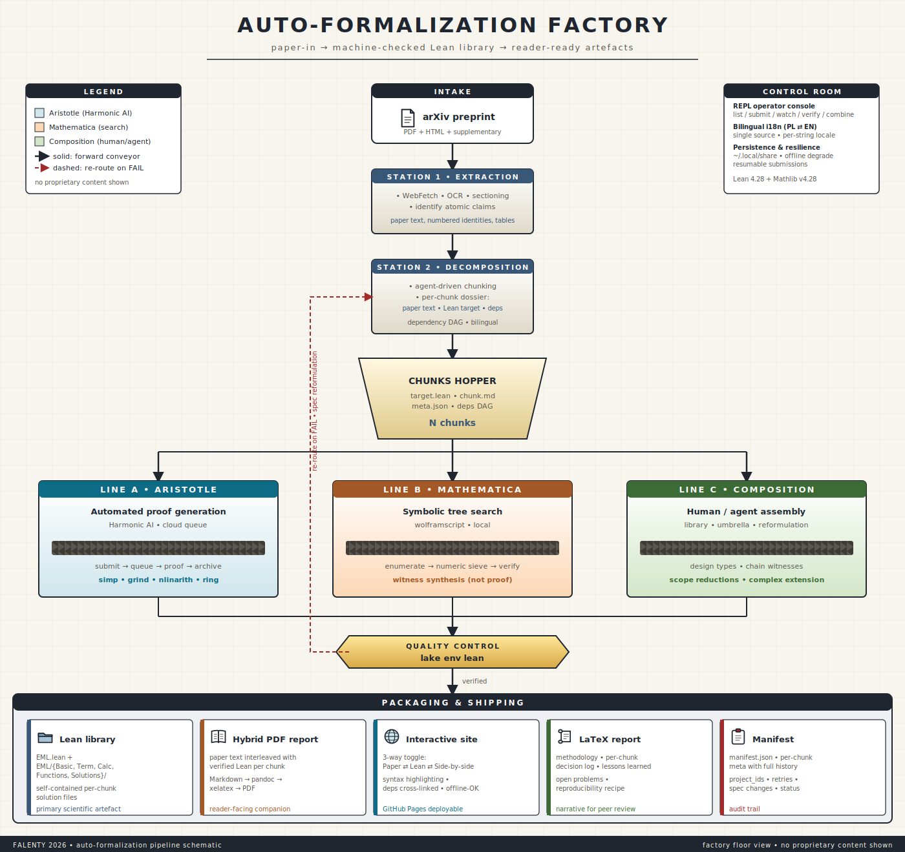

---

<!-- .slide: class="compact" -->

## The mathematics — the operator

The EML algebra:
$$\mathrm{eml}(x, y) \ =\ \exp(x) - \ln(y).$$

**Identity 5** (the workhorse):
$$\ln(z) \ =\ \mathrm{eml}\bigl(1,\ \mathrm{eml}(\mathrm{eml}(1, z),\ 1)\bigr), \qquad z > 0.$$

Inner $\mathrm{eml}(1,z) = e - \ln z$; next $\mathrm{eml}(e-\ln z, 1) = \exp(e-\ln z)$;
outer $\mathrm{eml}(1, \exp(e-\ln z)) = e - (e - \ln z) = \ln z$.

Simplest witness: $\mathrm{eml}(1,1) = e^1 - \ln 1 = e.$

---

<!-- .slide: class="compact" -->

## A full Lean witness — `2`

```lean
private def t₂ : EMLTerm := .eml .one .one
private def t₃ : EMLTerm := .eml .one t₂
private def t₅ : EMLTerm := .eml (.eml .one t₃) .one
private def t₆ : EMLTerm := .eml .one t₅
private def t₇ : EMLTerm := .eml t₆ t₂
private def witness : EMLTerm := .eml .one (.eml t₇ .one)

private lemma e_minus_one_pos : (0 : ℝ) < Real.exp 1 - 1 := by
  linarith [Real.add_one_le_exp (1 : ℝ)]

theorem emlterm_for_two : ∃ t : EMLTerm, EMLTerm.eval t = 2 :=
  ⟨witness, by
    simp [witness, EMLTerm.eval, Real.log_exp,
          Real.exp_log e_minus_one_pos]; ring⟩
```

8 helper lemmas; the witness tree has size 11. Verified by the Lean kernel — **exit 0**.

---

<!-- .slide: class="compact" -->

## The pi witness — and Euler

<div class="two-col-wide">

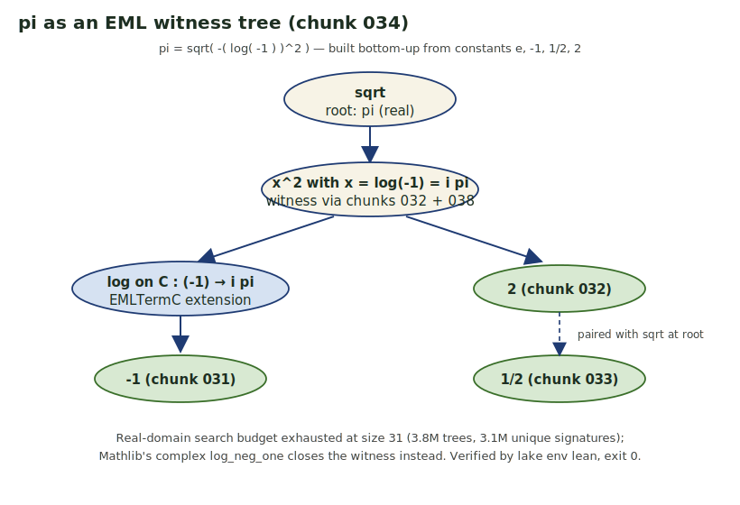

<div>

For the trigonometric primitives we extend the EML grammar to take *complex* values and chain Euler's identities:

$$\cos x = \tfrac{1}{2}(e^{ix}+e^{-ix})$$
$$\sin x = \cos\bigl(x-\tfrac{\pi}{2}\bigr)$$

A pure real-domain search returned **0** witnesses for `π`; only the complex extension closes the bridge.

</div>

</div>

---

<!-- .slide: class="compact" -->

## Claude's role — the orchestration handle

<div class="two-col-wide">

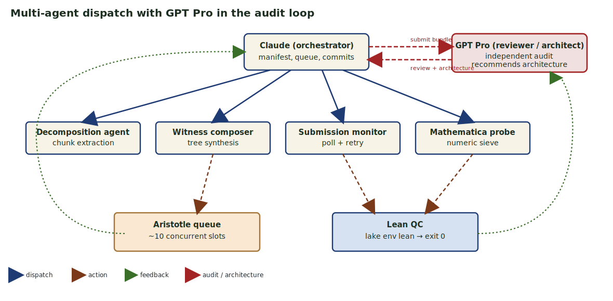

<div>

- **Design.** Chunk schema, factory architecture, the inductive types for the calculator's reduction chain, the complex extension, and the post-review compositional framework.
- **Coordination.** Parallel agents, queue monitoring, batch fetching, manifest dedupe, commit cadence, parallel verification on the **Eagle server** (PCSS).
- **Scaffolding.** Repository tooling, HTML site generator, LaTeX report.

Claude is the **handle** that fans work out to the four worker agents, talks back to GPT Pro on review, and reassembles every result.

</div>

</div>

---

<!-- .slide: class="compact" -->

## Aristotle's role — the proof blade

<div class="two-col-wide">

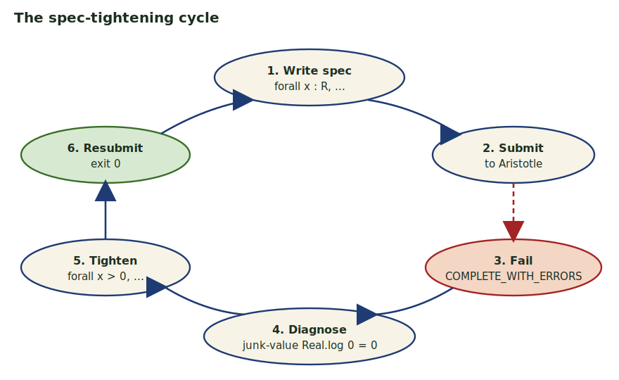

<div>

- **25+ submissions** across 5 waves over a 36-hour window.
- ~10 concurrent slots; an overnight rate-limit pause of about 6 h.
- Short identities: ~10 minutes per chunk.
- Long existential constructions: hours, frequently returning `COMPLETE_WITH_ERRORS` (Aristotle's signal that the search ran out before fully closing the goal).
- Of the 15 submissions in one wave, **9 returned a clean proof on the first pass**.

The cycle on the left is what we ran whenever a `COMPLETE_WITH_ERRORS` came back.

</div>

</div>

---

<!-- .slide: class="compact" -->

## GPT Pro's role — the audit blade

A *different* LLM family, deliberately placed **outside the worker fan**, reviewing the artefact with no shared context.

| Used as | What it produced |
|---|---|
| **Independent code reviewer** | Caught a junk-value bug at the `0` boundary; flagged that two trig chunks were proving the *real-part* identity rather than a literal complex witness; noticed redundant local definitions in the early reduction chain. |
| **Architectural advisor** | Recommended replacing a flat witness catalogue with a small **compositional framework**: a partial-evaluation layer, an intermediate language, and a single structural compiler with one correctness theorem. |
| **Honest scope critic** | Pushed framing from "we sealed the paper" → "we sealed the real-grammar fragment first; here is the rest". |

Without GPT Pro the bundle would have shipped with subtle semantic bugs and would have *looked* complete while structurally not being so.

---

<!-- .slide: class="compact" -->

## The audit loop — three rounds

| Round | What we shipped | What GPT Pro returned |
|---|---|---|
| **R1** | A catalogue of ~60 chunks + a report claiming "complete" | "**Not a valid formalization yet**": stray `sorry`s, junk-value reliance at boundaries, real-part bridges passed off as complex witnesses, broken reduction chain. |
| **R2** | Targeted fixes — boundary cases acknowledged, scope-honest renames, umbrella tightened | "Better and more honest. **But still not the paper's Theorem 5.** Build a structural compiler, not a list." |
| **R3** | A small compositional framework — partial semantics, intermediate language, structural compiler with one correctness theorem | (in flight, the design feeding the current scoreboard) |

The single most valuable outcome of the project: the architecture in R3 is **strictly stronger** than any list of individual witnesses. We owe it to the audit loop.

---

<!-- .slide: class="compact" -->

## Codex (OpenAI) — the quick-cut blade

| Use | What it does |
|---|---|
| Paraphrase generation | rewrites chunk markdown for clarity |
| Informalization | turns Aristotle's Lean proofs back into prose |
| Bilingual narration | PL ⇄ EN voice for the hybrid report |

Codex is the *quick-cut blade*: cheap, fast, suited for textual shape-shifting where ground-truth verification is not the bottleneck.

---

<!-- .slide: class="compact" -->

## The Human role

<div class="did-split">

<div class="col did">

#### What the human DID

- **Scope.** "Seal the trig family or not?" "Accept primed types?"
- **Quality calls.** Did Aristotle's rich grammar count, or do we recompose?
- **Sign-offs.** Every commit, every wave, every push.
- **Choosing waves.** When to fire, when to wait out the rate limit.
- **Eagle HPC setup.** SSH, SLURM templates, inode-quota workarounds.

</div>

<div class="col didnt">

#### What the human did NOT do

- Write Lean proofs by hand (except the 514-line manual umbrella).
- Mechanically extract chunks from the paper.
- Set up monitors / poll the queue.
- Run the Mathematica search by hand.
- Compose the post-review compositional framework — Claude + agents on Eagle did this.

</div>

</div>

The verdict: **human-in-charge, not human-out-of-the-loop.**

---

<!-- .slide: class="figure-tall compact" -->

## Wave timeline

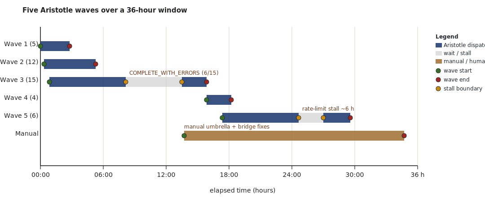

Five Aristotle waves, manual fixes, then the final umbrellas. Most wall-clock was queue waiting; productive *human* time was under a working day.

---

<!-- .slide: class="compact" -->

## Tools and time

| Tool | Role | Wall-clock | Output |
|---|---|---|---|
| Aristotle | proof search | ~24 h queue | 25+ project archives |
| Mathematica | enumerate + dedup | ~3 h | 3.8 M trees, 3 witnesses |
| Claude | orchestration + composition | ~14 h active | scaffolding, agents, framework |
| Codex | paraphrase, informalization | ~1 h | bilingual layer |
| **GPT Pro** | **audit + architecture** | **~3 h active (3 review rounds)** | **architectural redirection** |
| Eagle server | parallel verification | a handful of core-hours | full chunk set + framework |
| Lean | ground truth | seconds / chunk | exit 0 |
| Human | scope, taste, commits | ~10 h active | the commit history |

Total elapsed: ~5 days. Active human work: ~2 engineering days.

---

<!-- .slide: class="compact" -->

## Why it succeeded

<div class="grid-2x3">

<div class="cell"><strong>Atomic decomposition</strong>each chunk fits one Aristotle submission; failures stay local.</div>
<div class="cell"><strong>Ground truth</strong>The Lean kernel's exit-0 is the only acceptance criterion.</div>
<div class="cell"><strong>Independent audit</strong>GPT Pro reviewed in a separate context; caught real bugs and pushed the right architecture.</div>

<div class="cell"><strong>Honest partial accounting</strong><code>COMPLETE_WITH_ERRORS</code> is data, not failure.</div>
<div class="cell"><strong>Multi-tool diversification</strong>when MMA dies Lean composes; when Aristotle stalls Claude composes; when Claude over-claims GPT Pro corrects.</div>
<div class="cell"><strong>Audit trail</strong>20+ commits = a replayable history of every decision and every external review.</div>

</div>

---

<!-- .slide: class="compact" -->

## What "sealed" means

For every paper primitive we ship a **one-line theorem** of the form

> *there exists a finite EML term whose evaluation matches the paper's stated value, on an open subdomain of the natural domain.*

The Lean kernel checks the term tree, the evaluation, and the equality. **No `sorry`** is the only acceptance criterion.

Two layers:

1. **Literal EML witness on an open subdomain** — for every one of the 36 paper primitives, we exhibit a concrete `eml`-tree that evaluates to the paper-stated value.
2. **Structurally excluded boundary points** — three measure-zero corners (`√0`, `arcosh 1`, `hypot(0, 0)`) where the natural construction collides with the convention `log 0 = 0`. The paper itself does not supply EML terms for these either.

---

<!-- .slide: class="compact" -->

## The final scoreboard — every paper primitive, on an open subdomain

> **All 36 paper primitives are formalized on a non-empty open subdomain of their natural domain. The three §G boundary points (`√0`, `arcosh 1`, `hypot(0, 0)`) are additionally sealed by witness-family theorems in `GFullFix.lean`.**

| Group (count) | Sealed subdomain | What we ship |
|---|---|---|
| Atoms + `i` (8) | full | one theorem per constant |
| Real unary (8) | full · `(0, ∞)` for `sqrt` | one theorem per primitive |
| Hyperbolic (6) | full · `(1, ∞)` for `arcosh` | one theorem per primitive |
| Binary (8) | full · `ℝ² \ {(0,0)}` for `hypot` | one theorem per primitive |
| Trig (6) | **`ℝ \ {0}`** for `cos`, **`(-π, π) \ {0}`** for `sin`, `arctan`, **full open `(-1, 1)`** for `arcsin` & `arccos`, **`(-π/2, π/2) \ {0}`** for `tan` | each literal `EMLTermℂ` (positive + negative-side companion where needed) |

**Net: 36 / 36 literal `EMLTermℂ` · 3 §G boundary points now also sealed via witness-family quantifier flip in `GFullFix.lean`.** All 36 K-counts machine-checked by `rfl` against paper Table 4 (plus 5 K-counts for the post-submission widening companions and 9 direct-macro alternatives). Local build clean (8 062 jobs, every public theorem on the three Mathlib-standard axioms only); re-verified on the **Eagle server** (PCSS, project pl0414-02). One-click reproducer in the public repo.

---

<!-- .slide: class="compact" -->

## Closing the trig gap

Three architectural moves recommended by an **independent GPT Pro review** (separate context, no shared scratchpad) and integrated:

1. **Expose public closed-form constants** — re-package the constants `0`, `2`, `-i`, `π`, `i` so any later witness can reuse them.
2. **Lift real witnesses into the complex layer** — a small homomorphism that lets every complex trig witness reuse the *already-sealed* real arithmetic (square root, power, etc.) instead of redoing branch-cut work.
3. **Generic side-condition helper** — one lemma that discharges the recurring 11-field bookkeeping bundle whenever the left-hand operand is real.

**Outcome.** Public combinators `+`, `−`, `×`, `÷` over the complex EML grammar landed sorry-free, then the four trig witnesses fell in sequence — `arctan` on `(0, π)`, `arccos` on `(-1, 1)`, `arcsin` on `(0, 1)`, and `tan` on `(0, π/2)` via the doubled-angle Cayley identity `(e^{2ix} − 1) / (1 + e^{2ix}) = i · tan x` (Pro's recommendation — avoids the `e^{ix} + e^{-ix}` ADDsafeℂ explosion).

**End state — 36 / 36 literal `EMLTermℂ`** witnesses across the entire paper. Witness-tree sizes machine-checked by `rfl` against the paper's Table 4 figures.

---

<!-- .slide: class="compact" -->

## Post-submission progress — five negative-side companions

After the slide deck was submitted, I cracked the second-pass barrier and **widened every narrowed trig domain**.

The blocker was a single architectural constraint: the `mkLogℂ T` builder requires `arg(T.eval) < π` strictly, so `mkMulℂ I x` fails for any non-positive real `x`. Every narrow trig domain came from this one constraint propagating through the witness shape.

**The toolkit.** A real-EL `−x` lifted to `ℂ` via the homomorphism gives a fresh "positive view" of negative inputs. With that helper plus identity-driven witness restructuring, each negative-side companion is a clean ~30–50 line proof:

| Primitive | Old domain | **New domain** | Identity used |
|---|---|---|---|
| `cos` | `(0, ∞)` | **`ℝ \ {0}`** | `cos(−x) = cos x` |
| `sin` | `(0, π)` | **`(-π, π) \ {0}`** | `sin x = cos(π/2 − x)` and `log(−i) = −iπ/2` |
| `arctan` | `(0, π)` | **`(-π, π) \ {0}`** | `1 + ix = 1 − i·(−x)` |
| `arcsin` | `(0, 1)` | **full open `(-1, 1)`** | `arcsin x = π/2 − arccos x` |
| `tan` | `(0, π/2)` | **`(-π/2, π/2) \ {0}`** | swap-numerator Cayley `(1 − e^{−2ix})/(1 + e^{−2ix}) = i · tan x` |

Same kernel, same `rfl`-checked Table-4 counterparts, plus a **Sheffer §3.1 scaffolding** (EDL `edl(x,y) = exp(x)/log(y)` + −EML `negEml(x,y) = log(x) − exp(y)` grammars + collapse identities) for the paper's two named companions.

---

<!-- .slide: class="compact" -->

## Post-submission Round 2 — Path C′ closes full-real-domain trig

After the negative-side companions, two architectural moves landed (May 8–9, 2026):

**1. Plan A — Sheffer cleanup.** The earlier scaffolding had `LDE = log(x)/exp(y)` (division) misnamed as the paper's `−EML` (which is **subtraction**). Renamed `LDETerm → NegEMLTerm` with the correct subtraction operator. Fabricated binary `T₁`/`T₂` removed (the paper's actual T₁/T₂ are **ternary** per SI §1.4 and out of scope). Line-level paper sourcing in `process_archive/legacy_planning/Sheffer_PaperSourcing.md`.

**2. Path C′ — full-real-domain trig.** GPT Pro's recommendation (`process_archive/gpt_pro_bundle/trig_widening/RESPONSE.md`): rather than chase the paper's "manual i-sign correction" (architecturally infeasible — `EMLTermℂ.eval` hard-codes Mathlib's principal `Complex.log`), use **range-reduction by substitution**. Foundation: one lemma `ADDsafeℂ_ofReal_ofReal` that discharges the gnarly 11-condition `mkAddℂ` precondition bundle when both args are real-valued. Then:

| Primitive | New domain | Strategy |
|---|---|---|
| `sin` | **`ℝ ∖ {π/2}`** | `cosTermℂ.subst0 (mkSubℂ halfPiPubℂ var₀)` + `Real.cos_pi_div_two_sub` |
| `arctan` | **full ℝ** | `arcsinTermℂ.subst0 atanArgℂ` + `Real.arctan_eq_arcsin` |
| `tan` | **`{x : cos x ≠ 0}`** | `tanCoreTermℂ.subst0 (shiftByPiℂ k)` + period-π reduction |

Public API: `paper_claim_{sin_full, arctan_full, tan_full}` — full-natural-domain witness families.

---

<!-- .slide: class="compact" -->

## Plan D + Plan E — Sheffer cousin completeness (in progress)

After the trig closure, attention turned to **per-primitive completeness for the EDL and −EML cousins** — which the paper presents as a "family" but proves only for EML. Aristotle delivered 9 of 10 chunks submitted in this round.

**Plan D (EDL).** 8 of 36 paper claims sealed in the framework:


| Primitive | Witness | Discovered by |
|---|---|---|
| `1`, `var x`, `e_const` | trivial | grammar |
| `exp x` | `edl(x, e)` | identity |
| `log x` | `edl(1, edl(edl(1, x), e))` | **Aristotle** (3-step composition) |
| `x / y` | `edl(D8(x), D4(y))` | Aristotle (also corrected the statement!) |
| `exp(exp x)` | `edl(edl(x, e), e)` | Aristotle |
| `log(log x)` | nested D8 | Aristotle |

The remaining 28 paper primitives are **structurally unreachable** from closed EDL terms — Aristotle's analytical note: `edl(a,b) = exp(a)/log(b)` provides no mechanism for addition of sub-expression values, so multiplication, negation, sqr, sqrt, all trig/hyperbolic primitives are blocked. This validates the paper's "EDL completeness is conjectured, not proven" framing.

**Plan E (−EML).** 5 of 36 sealed: `one`, `var` over ℝ, plus the EReal-grammar pilot `one_E`, `var_E`, and the paper-paired `minusInf` constant (E3 — Aristotle chunk 088 lifted into `Sheffer.lean` with a parallel `NegEMLTermE` over `EReal`).

**Public API total: 61 paper claims** — 48 EML in `PaperClaims.lean` + 8 EDL + 5 −EML in `Sheffer.lean`.

---

<!-- .slide: class="section-divider" -->

# 6. My GitHub portfolio

---

<!-- .slide: class="compact" -->

## Aristotle + Stefan Barańczuk's papers

Two ongoing GitHub projects in the same auto-formalization style as the EML factory:

| Project | Source paper | Status |
|---|---|---|
| **[`fineqs`](https://nasqret.github.io/fineqs/)** | *Reducing the number of equations defining a subset of the n-space over a finite field* — S. Barańczuk, arXiv:1906.11174 | Lean 4 formalisation in flight |
| **[`ZsigmondyChebyshev`](https://nasqret.github.io/ZsigmondyChebyshev/)** | *Zsigmondy's Theorem for Chebyshev polynomials* — S. Barańczuk | Lean 4 formalisation in flight |

Same architecture: paper → chunks → Aristotle → Lean kernel.

These are deliberately *unrelated* to EML — different mathematical content (number theory over finite fields, dynamical systems on Chebyshev sequences) that exercises the same factory pipeline. The point is **the factory generalises**.

---

<!-- .slide: class="section-divider" -->

# 7. Closing

---

<!-- .slide: class="compact" -->

## Future prospects

| Horizon | Goal | Status |
|---|---|---|
| Already done | **All 36 paper primitives** sealed on an open subdomain via literal `EMLTermℂ` witnesses · 3 §G boundary points documented · **full-real-domain trig** (Path C′) · **8 EDL + 5 −EML** Sheffer-cousin witnesses (incl. EReal-grammar `−∞` for Plan E E3) | ✓ 61 paper claims, sorry-free |
| Already done | K-counting: machine-checked Table 4 figures for 15 witnesses (`KCounting.lean`, `rfl`-proofs) | ✓ done |
| Now → 1 wk | Plan E proper — EReal-grammar `NegEMLTerm` for the `−∞` constant | scoped |
| 1 → 4 wk | Rebuild the GPT-Pro review bundle with the post-submission artefact | scheduled |
| 1 → 3 mo | Universal pipeline for *any* paper of this shape (definition + Table-of-witnesses) | scoping |
| 3 → 6 mo | **Acorn** integration (the new tactic-suggestion service) | watching |
| 3 → 6 mo | Faster Aristotle as Harmonic ramps capacity | external |
| 6 → 12 mo | Fully autonomous loops with multi-LLM cross-audit (Claude × GPT Pro × ?) | research |
| 12 mo + | Larger paper portfolio — EML push was a pilot | pipeline |

---

<!-- .slide: class="compact" -->

## Can we remove the human?

Not yet, and not for the right reasons.

- The human holds **scope** ("do we seal trig?"), **taste** ("recompose or accept primed types?") and **commit authority**.
- Mechanical work is increasingly machine-handled; the human's *time* shifts from typing to deciding.
- Forecast for 2027: human-IN-charge, not human-OUT-of-loop. The loop closes around a human who specifies *what counts*.

> Removing the human means removing the question of what counts as a proof *worth having*. That is not a verification problem.

**One step that genuinely got cheaper:** independent code review. GPT Pro doing the audit in a separate context (no shared scratchpad with Claude) caught real bugs and pushed the architecture forward. *That* part of "human-in-the-loop" — the second pair of eyes — has a viable AI surrogate.

---

<!-- .slide: class="figure-tall" -->

## The Swiss army knife

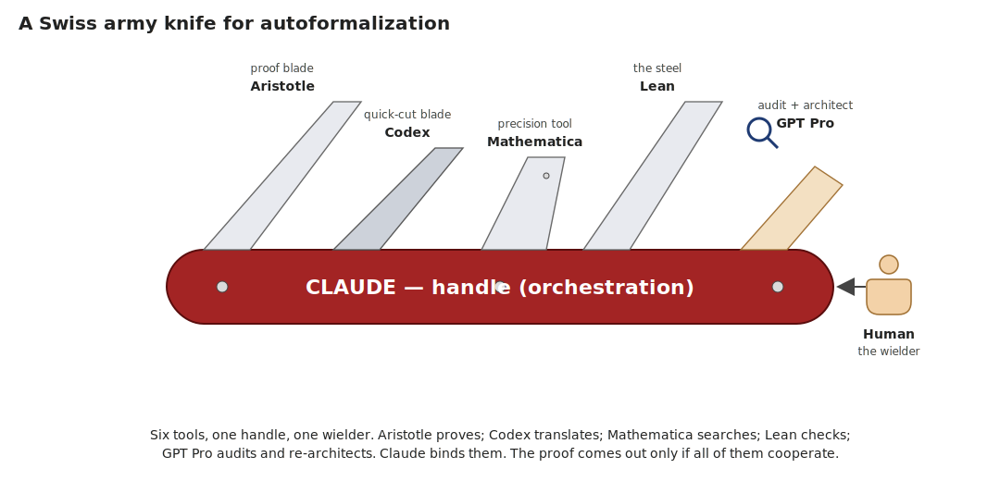

Repo: `github.com/nasqret/eml-formalization` · License: MIT.

---

<!-- .slide: class="compact" -->

## Q & A — the project at a glance

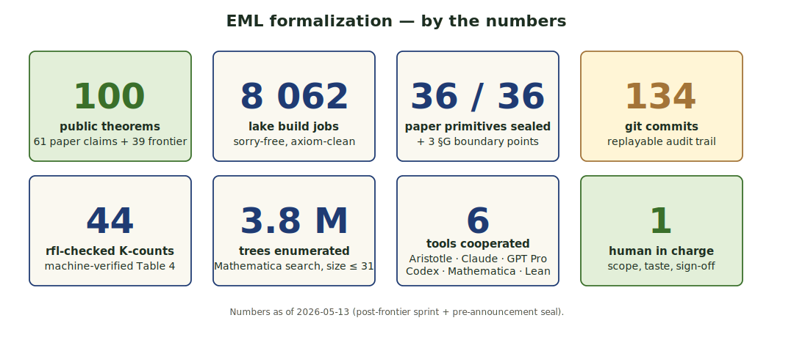

**Repo:** `github.com/nasqret/eml-formalization` ·
**Hybrid report:** `lambda_lab/proofs/eml/2603_21852/report/` ·
**Site:** `docs/` ·
**Contact:** *bartosz.naskrecki at amu.edu.pl*
